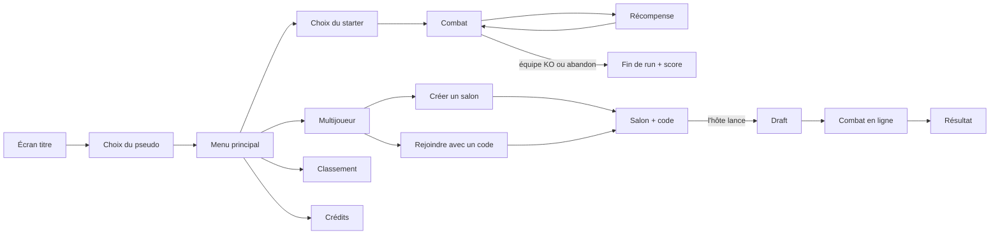

# 01 — Game Design Document

> Toutes les valeurs (stats, puissances, pourcentages) sont un **premier jet d'équilibrage**. Elles se trouvent dans `shared/data/` et peuvent être modifiées sans toucher au moteur.

## 1. Concept

- **Genre** : roguelike + combat au tour par tour façon Pokémon.
- **Univers** : médiéval-fantasy sombre (donjons, cryptes, forêts maudites).
- **Direction artistique** : pixel-art, résolution interne **480 × 270** mise à l'échelle sans flou.
- **Durée d'une partie** : 10 à 20 minutes en solo, 5 à 10 minutes en duel.

## 2. Modes de jeu

### 2.1 Solo : « La Descente »
1. Le joueur choisit **1 starter parmi 3**.
2. Il enchaîne des **vagues** d'ennemis contrôlés par l'IA.
3. Après chaque vague gagnée, il choisit **1 récompense parmi 3**. Plus l'ennemi vaincu est rare, meilleur est le butin (§6.2).
4. Toutes les 5 vagues, un **boss** apparaît (US-13), avec un butin de boss.
5. L'équipe compte **4 monstres au maximum**.
6. Si toute l'équipe est KO, la run est terminée. Le joueur peut aussi **abandonner** la run à tout moment pendant un combat (bouton « Abandonner », avec confirmation).

### 2.2 Multijoueur : « Duel Rogue » (1v1 en ligne)
1. Le joueur A crée un **salon** et reçoit un **code à 6 caractères**. Le joueur B le rejoint avec ce code.
2. **Draft** (US-18) : chaque joueur reçoit 6 monstres tirés au hasard (hors boss) et en garde 3, dans l'ordre d'entrée en combat. Les deux joueurs choisissent en même temps ; le choix adverse n'est révélé qu'au début du combat.
3. **Combat** : à chaque tour, les deux joueurs choisissent leur action **en même temps et en secret**. Le serveur résout le tour quand les deux actions sont reçues.
4. **Revanche** (US-44) : en fin de duel, l'un ou l'autre joueur clique « Revanche » (touche R) ; un nouveau match (nouveau draft) démarre dans le même salon, sans nouveau code, et l'autre joueur y est emmené automatiquement.
5. **Format** : MVP en 1 manche. *Could* : BO3 avec une phase de récompense entre les manches (le perdant de la manche choisit parmi 4 récompenses au lieu de 3) et soin complet des équipes.

## 3. Règles de combat

### 3.1 Déroulé d'un tour
1. Chaque joueur choisit **une action** pour son monstre actif :
   - **Compétence** : utiliser l'une de ses compétences (dans la limite de ses PP).
   - **Changer** : remplacer le monstre actif par un monstre de l'équipe encore en vie.
   - **Abandonner** : en duel, l'adversaire gagne ; en solo, la run s'arrête à la vague en cours.
2. **Ordre de résolution** :
   1. les abandons ;
   2. les changements de monstre ;
   3. les compétences, par **priorité** décroissante, puis par **VIT** décroissante, puis au hasard en cas d'égalité.
3. Un monstre mis KO avant d'avoir agi **n'agit pas**.
4. Quand un monstre actif tombe KO, son joueur **choisit le monstre qui le remplace** parmi ceux encore en vie. Ce choix ne coûte pas de tour :
   - en solo, le menu n'affiche plus que la liste de l'équipe (« X est K.O. ! Choisissez le monstre qui prend sa place. »), sans retour possible ; l'IA choisit le sien tout de suite (le monstre qui a l'avantage d'élément) ;
   - en duel, le combat passe par une **phase de remplacement** : seul le joueur concerné joue, l'adversaire voit « l'adversaire choisit son remplaçant… ». Sans réponse avant la fin du compte à rebours, le premier monstre en vie entre en combat.
5. Un joueur dont tous les monstres sont KO **perd**.

### 3.2 Statistiques

| Stat | Rôle |
|---|---|
| **PV** | Points de vie. À 0, le monstre est KO |
| **ATQ** | Augmente les dégâts infligés |
| **DEF** | Réduit les dégâts reçus |
| **VIT** | Détermine l'ordre d'action |

Stat au niveau `N` : `floor(base × (1 + (N − 1) × 0,08))`

### 3.3 Formule de dégâts

```
facteurNiveau = (niveau + 10) / 60
dégâts = puissance × (ATQ / DEF) × facteurNiveau
         × multiplicateurÉlément   (×2 / ×1 / ×0,5)
         × bonusMêmeÉlément        (×1,25 si la compétence a l'élément du monstre, hors neutre)
         × aléa                    (entre 0,90 et 1,00)
         × critique                (×1,5, 1 chance sur 16)
dégâts = max(1, arrondi inférieur)
```

*Ordre de grandeur* : niveau 5, puissance 50, ATQ = DEF → environ 12 dégâts pour ~66 PV, soit 5 coups. Avec un super efficace et le bonus d'élément → environ 30 dégâts, soit 2 à 3 coups.

### 3.4 Éléments

Un triangle (comme Feu / Plante / Eau) plus un duo opposé :

```
      🔥 Feu
     ↗     ↘
 💧 Eau ←── 🌿 Nature        ☀️ Lumière ⇄ 🌑 Ombre      ⚪ Neutre
```

| Attaque ↓ / Défense → | Feu | Eau | Nature | Lumière | Ombre | Neutre |
|---|---|---|---|---|---|---|
| **Feu** | 1 | 0,5 | **2** | 1 | 1 | 1 |
| **Eau** | **2** | 1 | 0,5 | 1 | 1 | 1 |
| **Nature** | 0,5 | **2** | 1 | 1 | 1 | 1 |
| **Lumière** | 1 | 1 | 1 | 1 | **2** | 1 |
| **Ombre** | 1 | 1 | 1 | **2** | 1 | 1 |
| **Neutre** | 1 | 1 | 1 | 1 | 1 | 1 |

> Lumière et Ombre se font mutuellement ×2 : les combats entre ces deux éléments sont courts et risqués.

## 4. Compétences

npm notice run dark-dungeon-fantasy-boss-battle@0.1.0 npx
npm notice run 'tsx' /tmp/claude-1000/-home-giganotosorus-IIA-BTS2-Agile/8ae5c212-48e8-4d0c-b23e-47eea327ebbe/scratchpad/tables.ts
| id | Nom | Élément | Puissance | PP | Priorité | Effet |
|---|---|---|---|---|---|---|
| `strike` | Frappe | Neutre | 40 | ∞ | 0 | — |
| `quick_strike` | Frappe rapide | Neutre | 25 | 13 | **+1** | Agit avant les autres |
| `fireball` | Boule de feu | Feu | 50 | 13 | 0 | — |
| `inferno` | Souffle ardent | Feu | 80 | 4 | 0 | — |
| `water_jet` | Jet d'eau | Eau | 50 | 13 | 0 | — |
| `deluge` | Déluge | Eau | 80 | 4 | 0 | — |
| `vine` | Liane | Nature | 50 | 13 | 0 | — |
| `regrowth` | Régénération | Nature | — | 3 | 0 | Soigne 30 % des PV max |
| `shadow_claw` | Griffe d'ombre | Ombre | 50 | 13 | 0 | — |
| `life_drain` | Drain vital | Ombre | 40 | 6 | 0 | Soigne 50 % des dégâts infligés |
| `holy_ray` | Rayon sacré | Lumière | 50 | 13 | 0 | — |
| `blessing` | Bénédiction | Lumière | — | 2 | 0 | DEF ×1,15 jusqu'à la fin du combat |
| `bite` | Morsure | Neutre | 60 | 10 | 0 | — |
| `rock_throw` | Jet de roc | Neutre | 70 | 6 | 0 | — |
| `harden` | Durcissement | Neutre | — | 2 | 0 | DEF ×1,15 jusqu'à la fin du combat |
| `shell_guard` | Carapace | Eau | — | 2 | 0 | DEF ×1,15 jusqu'à la fin du combat |
| `soothing_song` | Chant apaisant | Eau | — | 3 | 0 | Soigne 30 % des PV max |
| `thorn_storm` | Tempête d'épines | Nature | 80 | 4 | 0 | — |
| `sunburst` | Éclat solaire | Lumière | 80 | 4 | 0 | — |
| `soul_leech` | Siphon d'âme | Ombre | 60 | 5 | 0 | Soigne 50 % des dégâts infligés |
| `war_cry` | Cri de guerre | Neutre | — | 2 | 0 | ATQ ×1,15 jusqu'à la fin du combat |
| `rumble` | Grondement | Neutre | — | 2 | 0 | ATQ ×1,15 jusqu'à la fin du combat |
| `howl` | Hurlement | Neutre | — | 2 | 0 | ATQ ×1,15 jusqu'à la fin du combat |
| `sharpen` | Aiguisage | Neutre | — | 2 | 0 | ATQ ×1,15 jusqu'à la fin du combat |
| `kindle` | Embrasement | Feu | — | 2 | 0 | ATQ ×1,15 jusqu'à la fin du combat |
| `rising_tide` | Marée montante | Eau | — | 2 | 0 | ATQ ×1,15 jusqu'à la fin du combat |
| `growth` | Croissance | Nature | — | 2 | 0 | ATQ ×1,15 jusqu'à la fin du combat |
| `holy_zeal` | Ferveur sacrée | Lumière | — | 2 | 0 | ATQ ×1,15 jusqu'à la fin du combat |
| `dark_pact` | Pacte ténébreux | Ombre | — | 2 | 0 | ATQ ×1,15 jusqu'à la fin du combat |

> `∞` : la compétence ne s'épuise jamais. **Chaque espèce a 3 compétences et la Frappe** (`strike`), ce qui garantit qu'un monstre a toujours une action possible.
>
> **17/09, après le rendu** : PP des attaques relevés de 25 % (arrondi ; soins et boosts inchangés) et 9 boosts d'attaque ajoutés (`atkUp`, un par famille : cri de guerre, grondement, hurlement, aiguisage, embrasement, marée montante, croissance, ferveur sacrée, pacte ténébreux). Les boosts d'ATQ et de DEF durent jusqu'à la fin du combat ; en solo, ils sont remis à zéro entre deux vagues.

## 5. Bestiaire

Les sprites sont dessinés par le code de `tools/art/monsters.mjs` (voir [CREDITS](CREDITS.md)). Le tableau est trié par rareté puis par puissance.

| id | Nom | Élément | PV | ATQ | DEF | VIT | Puissance | Rareté | Compétences | Rôle en solo |
|---|---|---|---|---|---|---|---|---|---|---|
| `slime` | Slime | Nature | 65 | 40 | 50 | 30 | **185** | Commun | vine, regrowth, growth, strike | Vagues dès la 1re · évolue en Roi slime (niv. 10) |
| `skeleton` | Squelette | Ombre | 50 | 55 | 55 | 40 | **200** | Commun | shadow_claw, life_drain, dark_pact, strike | Vagues dès la 1re · évolue en Seigneur squelette (niv. 10) |
| `bat` | Chauve-souris vampire | Ombre | 40 | 55 | 35 | 75 | **205** | Commun | life_drain, bite, quick_strike, strike | Vagues dès la 1re · évolue en Seigneur vampire (niv. 10) |
| `goblin` | Gobelin | Neutre | 45 | 55 | 40 | 70 | **210** | Commun | quick_strike, shadow_claw, war_cry, strike | Vagues dès la 1re · évolue en Chef gobelin (niv. 10) |
| `flying_eye` | Œil volant | Ombre | 40 | 60 | 35 | 75 | **210** | Commun | shadow_claw, quick_strike, life_drain, strike | Vagues dès la 1re · évolue en Œil tyran (niv. 10) |
| `crab` | Crabe des abysses | Eau | 55 | 60 | 70 | 25 | **210** | Commun | water_jet, shell_guard, sharpen, strike | Vagues dès la 1re · évolue en Crabe titan (niv. 10) |
| `ghost` | Spectre | Ombre | 45 | 60 | 45 | 60 | **210** | Commun | soul_leech, shadow_claw, dark_pact, strike | Vagues dès la 1re · évolue en Banshee (niv. 10) |
| `imp` | Diablotin | Feu | 45 | 65 | 35 | 70 | **215** | Peu commun | fireball, shadow_claw, kindle, strike | Vagues dès la 3e |
| `wisp` | Feu follet | Lumière | 40 | 60 | 35 | 80 | **215** | Peu commun | holy_ray, quick_strike, blessing, strike | Vagues dès la 3e |
| `golem` | Golem de pierre | Neutre | 80 | 60 | 55 | 20 | **215** | Peu commun | rock_throw, harden, rumble, strike | Vagues dès la 3e |
| `mushroom` | Champignon | Nature | 65 | 55 | 60 | 40 | **220** | Peu commun | vine, regrowth, growth, strike | **Starter** · évolue en Myconide (niv. 24) |
| `knight` | Chevalier déchu | Lumière | 65 | 55 | 65 | 35 | **220** | Peu commun | holy_ray, blessing, holy_zeal, strike | Vagues dès la 3e |
| `wolf` | Loup sylvestre | Nature | 55 | 65 | 40 | 65 | **225** | Peu commun | vine, bite, howl, strike | Vagues dès la 3e |
| `treant` | Tréant | Nature | 75 | 60 | 65 | 25 | **225** | Peu commun | thorn_storm, vine, regrowth, strike | Vagues dès la 3e |
| `salamander` | Salamandre | Feu | 55 | 70 | 45 | 60 | **230** | Rare | fireball, inferno, kindle, strike | **Starter** · évolue en Drakéide (niv. 24) |
| `undine` | Ondine | Eau | 60 | 60 | 55 | 55 | **230** | Rare | water_jet, deluge, rising_tide, strike | **Starter** · évolue en Naïade (niv. 24) |
| `siren` | Sirène | Eau | 60 | 60 | 50 | 60 | **230** | Rare | deluge, water_jet, soothing_song, strike | Vagues dès la 5e |
| `unicorn` | Licorne | Lumière | 60 | 55 | 55 | 62 | **232** | Rare | holy_ray, blessing, holy_zeal, strike | Vagues dès la 5e |
| `slime_king` | Roi slime | Nature | 88 | 52 | 62 | 30 | **232** | Rare | vine, regrowth, growth, strike | Évolution de Slime (niv. 10) |
| `griffin` | Griffon | Lumière | 60 | 65 | 50 | 65 | **240** | Rare | sunburst, holy_ray, sharpen, strike | Vagues dès la 5e |
| `skeleton_lord` | Seigneur squelette | Ombre | 62 | 66 | 67 | 45 | **240** | Rare | soul_leech, shadow_claw, dark_pact, strike | Évolution de Squelette (niv. 10) |
| `titan_crab` | Crabe titan | Eau | 65 | 76 | 72 | 30 | **243** | Rare | deluge, shell_guard, sharpen, strike | Évolution de Crabe des abysses (niv. 10) |
| `goblin_chief` | Chef gobelin | Neutre | 55 | 72 | 50 | 68 | **245** | Épique | bite, shadow_claw, war_cry, strike | Évolution de Gobelin (niv. 10) |
| `tyrant_eye` | Œil tyran | Ombre | 52 | 74 | 42 | 77 | **245** | Épique | soul_leech, shadow_claw, quick_strike, strike | Évolution de Œil volant (niv. 10) |
| `banshee` | Banshee | Ombre | 55 | 72 | 48 | 70 | **245** | Épique | soul_leech, life_drain, dark_pact, strike | Évolution de Spectre (niv. 10) |
| `vampire_lord` | Seigneur vampire | Ombre | 55 | 70 | 45 | 77 | **247** | Épique | soul_leech, bite, quick_strike, strike | Évolution de Chauve-souris vampire (niv. 10) |
| `kraken` | Kraken | Eau | 80 | 70 | 60 | 40 | **250** | Épique | deluge, bite, rising_tide, strike | Vagues dès la 8e |
| `phoenix` | Phénix | Feu | 65 | 75 | 50 | 65 | **255** | Épique | inferno, fireball, regrowth, strike | Vagues dès la 8e |
| `myconid` | Myconide | Nature | 75 | 65 | 70 | 45 | **255** | Épique | thorn_storm, vine, growth, strike | Évolution de Champignon (niv. 24) |
| `drakeid` | Drakéide | Feu | 65 | 80 | 50 | 65 | **260** | Épique | inferno, fireball, kindle, strike | Évolution de Salamandre (niv. 24) |
| `naiad` | Naïade | Eau | 70 | 70 | 60 | 60 | **260** | Épique | deluge, water_jet, rising_tide, strike | Évolution de Ondine (niv. 24) |
| `demon` | Démon mineur | Feu | 90 | 70 | 60 | 50 | **270** | Boss | inferno, shadow_claw, kindle, strike | **Boss** (vagues 5, 10…) |
| `lich` | Liche | Ombre | 85 | 75 | 55 | 55 | **270** | Boss | life_drain, shadow_claw, dark_pact, strike | **Boss** (vagues 5, 10…) |
| `hydra` | Hydre | Nature | 100 | 70 | 65 | 40 | **275** | Boss | thorn_storm, vine, regrowth, strike | **Boss** (vagues 5, 10…) |
| `dragon` | Dragon ancien | Feu | 95 | 75 | 65 | 45 | **280** | Boss | inferno, bite, rock_throw, strike | **Boss** (vagues 5, 10…) |

> 35 espèces : 25 de base (US-29, puis 5 nouvelles au sprint 4 : Chauve-souris vampire, Licorne, Kraken, Phénix, Hydre) et **10 évolutions** (US-41).
> Le Golem de pierre, neutre et donc faible à rien, a vu sa DEF passer de 75 à 55 (US-38).
>
> **Évolutions (solo uniquement)** : les 3 starters évoluent au niveau 24, les 7 monstres communs au niveau 10. Une évolution garde l'élément, les compétences, les PP et les PV perdus du monstre. Les évolutions ne sont jamais tirées directement : un ennemi commun tiré à un niveau suffisant arrive déjà évolué (donc à partir de la vague 11). Elles ne sont pas proposées au draft du duel.
> Chaque élément compte au moins 2 espèces non-boss, pour que le draft du duel (US-18) offre toujours des choix variés. Les boss restent réservés au solo ; les starters n'apparaissent pas dans les vagues.

### 5.1 Raretés

La rareté n'est pas saisie à la main : elle se déduit de la **puissance** de l'espèce, la somme de ses 4 stats de base (`shared/data/rarities.ts`). Un monstre rééquilibré change donc de rareté tout seul.

| Rareté | Puissance | Apparaît dans les vagues | Poids du tirage | Niveau de butin |
|---|---|---|---|---|
| Commun | moins de 215 | dès la vague 1 | 50 | 0 |
| Peu commun | 215 à 229 | dès la vague 3 | 30 | 1 |
| Rare | 230 à 244 | dès la vague 5 | 20 | 2 |
| Épique | 245 à 264 | dès la vague 8 | 12 | 3 |
| Boss | 265 et plus | seulement les vagues 5, 10, 15… | — | 4 |

Pour chaque ennemi d'une vague normale, on tire d'abord une rareté parmi celles déjà débloquées (selon les poids), puis une espèce de cette rareté. Répartition mesurée sur 2 000 seeds : vague 3 → 63 % communs, 37 % peu communs ; vague 8 → 45 % communs, 27 % peu communs, 17 % rares, 11 % épiques.

## 6. Boucle roguelike (solo)

### 6.1 Vagues

| Vague | Ennemis | Niveau ennemi |
|---|---|---|
| 1 – 4 | 1 monstre (communs, puis peu communs dès la vague 3) | `vague` (niveau 1 à la vague 1) |
| 5, 10, 15… | **1 boss** seul, bannière « Vague N · BOSS » | `vague + 1` |
| 6 et + | 2 monstres, raretés débloquées selon §5.1 | `vague` |

- Entre deux vagues : **+20 % des PV max** pour toute l'équipe.
- **Expérience** (US-36) : chaque monstre du joueur compte les ennemis qu'il met KO et gagne **1 niveau tous les 2 puis 3 KO**, en alternance (paliers à 2, 5, 7, 10… KO), pour que les niveaux ne montent pas trop vite (jamais pour les ennemis, jamais en duel). Le gain et l'éventuelle évolution s'affichent pendant le combat.
- **Ordre de l'équipe** : il ne change jamais. Le monstre qui termine une vague sur le terrain commence la suivante (s'il est KO, c'est le premier monstre en vie).
- Taille d'équipe maximale : **4 monstres**. Au-delà, un Recrutement demande quel monstre remplacer.
- Le tirage des ennemis et des récompenses utilise la **seed de la run** (voir [06](06-MOTEUR-DE-COMBAT.md#3-aléatoire-déterministe)).

### 6.2 Récompenses (1 au choix parmi 3)

Le **niveau de butin** d'une vague est celui de l'ennemi le plus rare qu'elle contient (§5.1). Une récompense n'est proposée que si le niveau de butin atteint son minimum ; au-dessus de ce minimum, son poids est multiplié par `1 + niveau de butin − minimum`. Les cartes de butin rare sont encadrées de la couleur de leur rareté.

| Récompense | Effet | Poids du tirage | Butin minimal |
|---|---|---|---|
| 🧪 Potion | Soigne 50 % des PV max de toute l'équipe, KO compris | 30 | 0 |
| ✨ Élixir | Recharge tous les PP | 15 | 0 |
| 🗡️ Entraînement | +1 niveau pour un monstre au choix | 20 | 0 |
| 🐾 Recrutement | Le monstre vaincu rejoint l'équipe (remplace un monstre si l'équipe compte déjà 4 monstres). **Garanti les vagues paires** | 35 | 0 |
| 📜 Parchemin | Montre la compétence tirée au hasard ; le joueur choisit celle qu'elle remplace (jamais la Frappe) | 10 | 0 |
| 💖 Potion royale | Soigne tous les PV et recharge tous les PP de l'équipe, KO compris | 14 | 1 (peu commun) |
| ⚔️ Entraînement intensif | +2 niveaux pour un monstre au choix | 12 | 2 (rare) |
| 🏕️ Camp d'entraînement | +1 niveau pour toute l'équipe (un KO reste KO) | 10 | 3 (épique) |
| 👑 Relique du boss | +2 niveaux pour toute l'équipe, entièrement soignée | garantie | 4 (boss) |

Les monstres gagnant maintenant leurs niveaux en combat, les récompenses d'entraînement ont été divisées par deux environ (US-36) : se soigner reste un vrai choix. Le Recrutement pèse 35 au lieu de 20 et il est **toujours proposé une vague sur deux** (US-42).

**Butin de boss** : après un boss, la Relique est toujours proposée, et les 2 autres cartes sont tirées parmi les butins rares et le Recrutement (qui fait alors rejoindre le **boss** à l'équipe). Les récompenses ordinaires (Potion, Élixir, Entraînement, Parchemin) ne sortent pas.

### 6.3 Score
`score = vague atteinte × 100 + PV restants en fin de run`

## 7. Écrans et parcours



## 8. Direction artistique et interface

- Résolution interne 480 × 270, mise à l'échelle `FIT`, `pixelArt: true` (pas de lissage).
- Sprites de monstres : **64 × 64** recommandés (des sprites de 32 px peuvent être affichés en ×2).
- L'ennemi est affiché à droite et en haut, le joueur à gauche et en bas. Si le pack n'a que des vues de profil, on utilise `flipX` pour que les deux camps se fassent face.
- Police pixel (par exemple *Press Start 2P* sur Google Fonts, licence OFL).
- Couleurs des éléments : Feu `#e0603a`, Eau `#3a8fe0`, Nature `#5dbb4a`, Lumière `#f2d45c`, Ombre `#7b4fb5`, Neutre `#b0a8a0`.
- Texte de combat : « Salamandre utilise Boule de feu ! », « C'est super efficace ! », « Coup critique ! ».
- Évolutions : même dessin que l'espèce de base, recoloré, avec un attribut en plus (couronne, ailes, cape, pédoncules…), généré par `npm run assets`.
- **Musique** (US-25) : *Boss Battle Retro Rock* en boucle pendant les combats solo et les duels, coupable avec le bouton 🔊 ou la touche M (choix mémorisé par le navigateur).

### 8.1 Contrôles au clavier (US-43)

Le jeu se joue entièrement sans souris (`src/lib/keyboard.ts`).

| Touche | Effet |
|---|---|
| Flèches | Passer d'un bouton ou d'un lien à l'autre (Tab marche aussi) |
| Entrée / Espace | Valider le bouton sélectionné |
| Échap | Retour (menu, sous-menu « Changer », choix de récompense, confirmation d'abandon) |
| 1 à 6 | Choisir la carte ou la compétence numérotée (starter, draft, compétences, remplaçant, récompense, monstre visé, compétence à oublier) |
| V | Valider le starter ou l'équipe du draft |
| C | Ouvrir « Changer » en combat |
| R | Revanche en fin de duel |
| M | Couper / remettre la musique |

À chaque changement de page, le premier bouton reçoit le focus. Les touches restent au champ texte quand on écrit un pseudo ou un code de salon.
