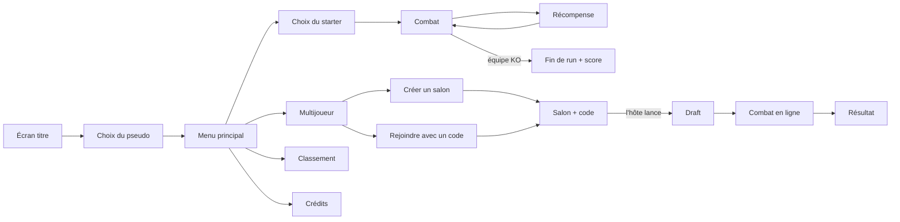

# 01 — Game Design Document

> Toutes les valeurs (stats, puissances, pourcentages) sont un **premier jet d'équilibrage**. Elles se trouvent dans `shared/data/` et peuvent être modifiées sans toucher au moteur.

## 1. Concept

- **Genre** : roguelike + combat au tour par tour façon Pokémon.
- **Univers** : médiéval-fantasy sombre (donjons, cryptes, forêts maudites).
- **Direction artistique** : pixel-art, résolution interne **480 × 270** mise à l'échelle sans flou.
- **Durée d'une partie** : 10 à 20 minutes en solo, 5 à 10 minutes en duel.

## 2. Modes de jeu

### 2.1 Solo : « La Descente »
1. Le joueur choisit **1 starter parmi 3**.
2. Il enchaîne des **vagues** d'ennemis contrôlés par l'IA.
3. Après chaque vague gagnée, il choisit **1 récompense parmi 3**.
4. Toutes les 5 vagues, un **boss** apparaît *(Could)*.
5. Si toute l'équipe est KO, la run est terminée. Le score est enregistré.

### 2.2 Multijoueur : « Duel Rogue » (1v1 en ligne)
1. Le joueur A crée un **salon** et reçoit un **code à 6 caractères**. Le joueur B le rejoint avec ce code.
2. **Draft** *(Should)* : chaque joueur reçoit 6 monstres tirés au hasard et en garde 3. Les deux joueurs choisissent en même temps. *Sans draft (MVP) : équipes de 3 tirées au hasard.*
3. **Combat** : à chaque tour, les deux joueurs choisissent leur action **en même temps et en secret**. Le serveur résout le tour quand les deux actions sont reçues.
4. **Format** : MVP en 1 manche. *Could* : BO3 avec une phase de récompense entre les manches (le perdant de la manche choisit parmi 4 récompenses au lieu de 3) et soin complet des équipes.

## 3. Règles de combat

### 3.1 Déroulé d'un tour
1. Chaque joueur choisit **une action** pour son monstre actif :
   - **Compétence** : utiliser l'une de ses compétences (dans la limite de ses PP).
   - **Changer** : remplacer le monstre actif par un monstre de l'équipe encore en vie.
   - **Abandonner** (multijoueur).
2. **Ordre de résolution** :
   1. les abandons ;
   2. les changements de monstre ;
   3. les compétences, par **priorité** décroissante, puis par **VIT** décroissante, puis au hasard en cas d'égalité.
3. Un monstre mis KO avant d'avoir agi **n'agit pas**.
4. En fin de tour, chaque monstre actif KO est **remplacé automatiquement** par le premier monstre en vie de l'équipe *(MVP ; laisser le joueur choisir = Could)*.
5. Un joueur dont tous les monstres sont KO **perd**.

### 3.2 Statistiques

| Stat | Rôle |
|---|---|
| **PV** | Points de vie. À 0, le monstre est KO |
| **ATQ** | Augmente les dégâts infligés |
| **DEF** | Réduit les dégâts reçus |
| **VIT** | Détermine l'ordre d'action |

Stat au niveau `N` : `floor(base × (1 + (N − 1) × 0,08))`

### 3.3 Formule de dégâts

```
facteurNiveau = (niveau + 10) / 60
dégâts = puissance × (ATQ / DEF) × facteurNiveau
         × multiplicateurÉlément   (×2 / ×1 / ×0,5)
         × bonusMêmeÉlément        (×1,25 si la compétence a l'élément du monstre, hors neutre)
         × aléa                    (entre 0,90 et 1,00)
         × critique                (×1,5, 1 chance sur 16)
dégâts = max(1, arrondi inférieur)
```

*Ordre de grandeur* : niveau 5, puissance 50, ATQ = DEF → environ 12 dégâts pour ~66 PV, soit 5 coups. Avec un super efficace et le bonus d'élément → environ 30 dégâts, soit 2 à 3 coups.

### 3.4 Éléments

Un triangle (comme Feu / Plante / Eau) plus un duo opposé :

```
      🔥 Feu
     ↗     ↘
 💧 Eau ←── 🌿 Nature        ☀️ Lumière ⇄ 🌑 Ombre      ⚪ Neutre
```

| Attaque ↓ / Défense → | Feu | Eau | Nature | Lumière | Ombre | Neutre |
|---|---|---|---|---|---|---|
| **Feu** | 1 | 0,5 | **2** | 1 | 1 | 1 |
| **Eau** | **2** | 1 | 0,5 | 1 | 1 | 1 |
| **Nature** | 0,5 | **2** | 1 | 1 | 1 | 1 |
| **Lumière** | 1 | 1 | 1 | 1 | **2** | 1 |
| **Ombre** | 1 | 1 | 1 | **2** | 1 | 1 |
| **Neutre** | 1 | 1 | 1 | 1 | 1 | 1 |

> Lumière et Ombre se font mutuellement ×2 : les combats entre ces deux éléments sont courts et risqués.

## 4. Compétences

| id | Nom | Élément | Puissance | PP | Priorité | Effet |
|---|---|---|---|---|---|---|
| `strike` | Frappe | Neutre | 40 | ∞ | 0 | — |
| `quick_strike` | Frappe rapide | Neutre | 25 | 10 | **+1** | Agit avant les autres |
| `fireball` | Boule de feu | Feu | 50 | 10 | 0 | — |
| `inferno` | Souffle ardent | Feu | 80 | 3 | 0 | — |
| `water_jet` | Jet d'eau | Eau | 50 | 10 | 0 | — |
| `deluge` | Déluge | Eau | 80 | 3 | 0 | — |
| `vine` | Liane | Nature | 50 | 10 | 0 | — |
| `regrowth` | Régénération | Nature | — | 3 | 0 | Soigne 30 % des PV max |
| `shadow_claw` | Griffe d'ombre | Ombre | 50 | 10 | 0 | — |
| `life_drain` | Drain vital | Ombre | 40 | 5 | 0 | Soigne 50 % des dégâts infligés |
| `holy_ray` | Rayon sacré | Lumière | 50 | 10 | 0 | — |
| `blessing` | Bénédiction | Lumière | — | 2 | 0 | DEF ×1,25 jusqu'à la fin du combat |

> `∞` : la compétence ne s'épuise jamais, ce qui garantit qu'un monstre a toujours une action possible.

## 5. Bestiaire

Les sprites proposés sont indicatifs : **adapter selon le pack choisi** (voir [CREDITS](CREDITS.md)).

| id | Nom | Élément | PV | ATQ | DEF | VIT | Compétences | Rôle |
|---|---|---|---|---|---|---|---|---|
| `salamander` | Salamandre | Feu | 50 | 65 | 40 | 55 | fireball, inferno, strike | **Starter** |
| `undine` | Ondine | Eau | 55 | 55 | 50 | 50 | water_jet, deluge, strike | **Starter** |
| `mushroom` | Champignon | Nature | 60 | 50 | 55 | 35 | vine, regrowth, strike | **Starter** |
| `goblin` | Gobelin | Neutre | 45 | 55 | 40 | 70 | strike, quick_strike, shadow_claw | Commun |
| `skeleton` | Squelette | Ombre | 50 | 55 | 55 | 40 | shadow_claw, life_drain, strike | Commun |
| `flying_eye` | Œil volant | Ombre | 40 | 60 | 35 | 75 | shadow_claw, quick_strike, life_drain | Commun |
| `slime` | Slime | Nature | 65 | 40 | 50 | 30 | vine, regrowth, strike | Commun |
| `knight` | Chevalier déchu | Lumière | 65 | 55 | 65 | 35 | holy_ray, blessing, strike | Rare |
| `demon` | Démon mineur | Feu | 90 | 70 | 60 | 50 | inferno, fireball, shadow_claw | **Boss** |
| `lich` | Liche | Ombre | 85 | 75 | 55 | 55 | life_drain, shadow_claw, holy_ray | **Boss** |

## 6. Boucle roguelike (solo)

### 6.1 Vagues

| Vague | Ennemis | Niveau ennemi |
|---|---|---|
| 1 – 4 | 1 monstre commun | `3 + vague` |
| 5, 10, 15… | 1 boss *(Could, sinon 2 communs)* | `4 + vague` |
| 6 et + | 2 monstres (communs ou rares) | `3 + vague` |

- Entre deux vagues : **+20 % des PV max** pour toute l'équipe.
- Taille d'équipe maximale : **4**.
- Le tirage des ennemis et des récompenses utilise la **seed de la run** (voir [06](06-MOTEUR-DE-COMBAT.md#3-aléatoire-déterministe)).

### 6.2 Récompenses (1 au choix parmi 3)

| Récompense | Effet | Poids du tirage |
|---|---|---|
| 🧪 Potion | Soigne 50 % des PV max de toute l'équipe | 30 |
| ✨ Élixir | Recharge tous les PP | 15 |
| 🗡️ Entraînement | +2 niveaux pour un monstre au choix | 25 |
| 🐾 Recrutement | Ajoute à l'équipe un monstre de l'espèce vaincue (remplace un monstre si l'équipe est pleine) | 20 |
| 📜 Parchemin | Remplace une compétence par une compétence tirée au hasard | 10 |

### 6.3 Score
`score = vague atteinte × 100 + PV restants en fin de run`

## 7. Écrans et parcours



## 8. Direction artistique et interface

- Résolution interne 480 × 270, mise à l'échelle `FIT`, `pixelArt: true` (pas de lissage).
- Sprites de monstres : **64 × 64** recommandés (des sprites de 32 px peuvent être affichés en ×2).
- L'ennemi est affiché à droite et en haut, le joueur à gauche et en bas. Si le pack n'a que des vues de profil, on utilise `flipX` pour que les deux camps se fassent face.
- Police pixel (par exemple *Press Start 2P* sur Google Fonts, licence OFL).
- Couleurs des éléments : Feu `#e0603a`, Eau `#3a8fe0`, Nature `#5dbb4a`, Lumière `#f2d45c`, Ombre `#7b4fb5`, Neutre `#b0a8a0`.
- Texte de combat : « Salamandre utilise Boule de feu ! », « C'est super efficace ! », « Coup critique ! ».
