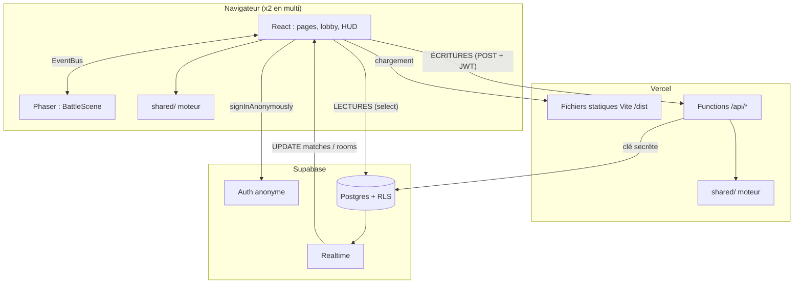

# 02 — Architecture technique

## 1. Choix de la stack

| Besoin | Choix | Pourquoi |
|---|---|---|
| Menus, formulaires, lobby | **React + TypeScript + Vite** | Stack JS recommandée par le TP ; compatible avec les maquettes exportées depuis Lovable (React + Tailwind) |
| Rendu du combat | **Phaser 4** | Moteur 2D mature (sprites, tweens, spritesheets, mise à l'échelle pixel-art). La plupart des tutos Phaser 3 restent valables |
| Règles du jeu | **TypeScript pur** dans `shared/` | Le même code tourne dans le navigateur (solo) et sur le serveur (multi) |
| Serveur autoritaire | **Vercel Functions** (`api/`) | Hébergées avec le front, gratuites, aucun serveur à gérer |
| Données + auth | **Supabase** Postgres + Auth anonyme | Recommandé par le TP, gratuit, sécurité par RLS |
| Temps réel | **Supabase Realtime** (`postgres_changes`) | Vercel ne convient pas pour garder des WebSockets ouvertes. Vercel recommande un fournisseur tiers, dont Supabase |
| Tests | **Vitest** | Intégré à Vite, rapide |

> **Pourquoi pas Socket.io ou un serveur Node permanent ?** Les fonctions Vercel sont éphémères : elles traitent une requête puis s'arrêtent. Le support WebSocket natif de Vercel (bêta, 2026) n'offre ni diffusion vers plusieurs clients ni présence. Pour du **tour par tour**, « requête HTTP pour jouer + notification temps réel pour recevoir » est plus simple et plus robuste.

## 2. Vue d'ensemble



### 🔑 La règle d'or

| Opération | Passe par | Pourquoi |
|---|---|---|
| **Lire** (profil, salon, état du match, classement) | Client → Supabase directement | Simple et rapide, protégé par la RLS |
| **Écrire une action de jeu** (créer ou rejoindre un salon, jouer un tour) | Client → **`/api/*`** → Supabase | Le serveur **valide** l'action et **calcule** le résultat : impossible de tricher en modifiant le JS |
| **Écrire des données non critiques** (pseudo, score solo) | Client → Supabase directement | Autorisé par une RLS stricte (on ne peut écrire que ses propres lignes) |

## 3. Arborescence

```
.                                 # racine du dépôt
├─ api/                          # ⚙️ Vercel Functions (Node, serveur autoritaire)
│  ├─ _lib/                      #   "_" : pas exposé comme endpoint
│  │  ├─ supabaseAdmin.ts        #   client Supabase avec la clé secrète
│  │  ├─ auth.ts                 #   requireUser() : vérifie le JWT
│  │  ├─ http.ts                 #   helpers de réponse / erreurs
│  │  └─ turns.ts                #   tryResolve() : résolution des tours
│  ├─ rooms/
│  │  ├─ create.ts
│  │  └─ join.ts
│  └─ match/
│     ├─ start.ts
│     ├─ draft.ts
│     ├─ action.ts
│     ├─ timeout.ts
│     └─ forfeit.ts
├─ shared/                       # 🧠 Code PUR partagé (ni React, ni Phaser, ni Supabase)
│  ├─ types.ts
│  ├─ data/  elements.ts · skills.ts · monsters.ts · rewards.ts
│  ├─ engine/ rng.ts · stats.ts · damage.ts · battle.ts · validate.ts · ai.ts · run.ts
│  └─ tests/  *.test.ts
├─ src/                          # 🖥️ Client
│  ├─ main.tsx · App.tsx (routes)
│  ├─ pages/ Title · Login · Menu · SoloRun · Lobby · Room · OnlineMatch · Leaderboard · Credits
│  ├─ game/
│  │  ├─ PhaserGame.tsx          #   monte/démonte le jeu Phaser dans React
│  │  ├─ EventBus.ts
│  │  ├─ config.ts
│  │  └─ scenes/ BootScene.ts · PreloadScene.ts · BattleScene.ts
│  ├─ lib/ supabase.ts · api.ts · realtime.ts
│  └─ components/                #   boutons, barre d'actions, modales (Lovable)
├─ public/assets/ sprites/ · ui/ · fonts/ · audio/
├─ supabase/migrations/001_init.sql
├─ docs/
├─ .env.example
├─ vercel.json
├─ vite.config.ts
└─ package.json
```

> **Imports dans `api/` et `shared/`** : utiliser des imports **relatifs avec extension `.js`** (`import { resolveTurn } from '../../shared/engine/battle.js'`). Vite et TypeScript comprennent cette syntaxe, et le runtime Node de Vercel l'exige en ESM. Pas d'alias `@/` dans ces dossiers.

## 4. Principes du moteur partagé (`shared/`)

1. **Pur** : `nouvelÉtat = f(ancienÉtat, actions, rng)`, sans effet de bord, sans DOM, sans réseau.
2. **Déterministe** : tout l'aléatoire passe par un générateur `rng` créé à partir d'une seed. Même seed + mêmes actions = même résultat.
3. **Sérialisable** : l'état est un simple objet JSON, stocké tel quel dans la colonne `matches.state` (jsonb).
4. **Produit des événements** : `resolveTurn` renvoie la liste `events[]` (dégâts, KO, changement…) que Phaser **rejoue** pour animer le tour. Le client n'a jamais à recalculer le combat.
5. **Testé** : chaque règle a au moins un test Vitest.

Les détails sont dans [06-MOTEUR-DE-COMBAT](06-MOTEUR-DE-COMBAT.md).

## 5. Liaison React ↔ Phaser

React gère les écrans et les boutons ; Phaser dessine le combat. Les deux communiquent par un **EventBus**, sur le modèle du template officiel Phaser + React.

```ts
// src/game/EventBus.ts
import { Events } from 'phaser';
export const EventBus = new Events.EventEmitter();
```

```ts
// src/game/config.ts
import { AUTO, Scale, type Types } from 'phaser';
import { BootScene } from './scenes/BootScene';
import { PreloadScene } from './scenes/PreloadScene';
import { BattleScene } from './scenes/BattleScene';

export const gameConfig: Types.Core.GameConfig = {
  type: AUTO,
  width: 480,
  height: 270,
  pixelArt: true,                 // pas de lissage des pixels
  backgroundColor: '#1a1423',
  scale: { mode: Scale.FIT, autoCenter: Scale.CENTER_BOTH },
  scene: [BootScene, PreloadScene, BattleScene],
};
```

```tsx
// src/game/PhaserGame.tsx
import { useLayoutEffect, useRef } from 'react';
import { Game } from 'phaser';
import { gameConfig } from './config';

export function PhaserGame() {
  const containerRef = useRef<HTMLDivElement>(null);

  useLayoutEffect(() => {
    const game = new Game({ ...gameConfig, parent: containerRef.current! });
    return () => game.destroy(true); // indispensable (StrictMode monte 2 fois en dev)
  }, []);

  return <div ref={containerRef} className="game-container" />;
}
```

### Événements échangés

| Événement | Sens | Données | Usage |
|---|---|---|---|
| `scene-ready` | Phaser → React | — | La scène est prête à recevoir un état |
| `battle-init` | React → Phaser | `BattleState`, `mySeat` | Afficher les monstres et les PV |
| `play-events` | React → Phaser | `BattleEvent[]` | Animer un tour résolu |
| `events-played` | Phaser → React | — | Réafficher le menu d'actions |
| `battle-end` | Phaser → React | `winnerSeat` | Afficher l'écran de fin ou de récompense |

Le **menu d'actions** (4 compétences, Changer, Abandonner) peut être en React par-dessus le canvas (plus rapide à coder, compatible avec Lovable) ou dans Phaser. **Recommandation : React.**

### Rejouer les événements dans Phaser

```ts
// src/game/scenes/BattleScene.ts (extrait)
async playEvents(events: BattleEvent[]) {
  for (const e of events) {
    switch (e.type) {
      case 'skill_used':
        this.showText(`${e.actorName} utilise ${e.skillName} !`);
        await this.wait(700);
        break;
      case 'damage':
        await this.flash(e.targetSeat);
        await this.tweenHpBar(e.targetSeat, e.hpAfter, e.maxHp);
        if (e.effectiveness > 1) { this.showText("C'est super efficace !"); await this.wait(600); }
        if (e.crit) { this.showText('Coup critique !'); await this.wait(600); }
        break;
      case 'faint':
        await this.playFaint(e.seat);
        break;
      case 'switch':
        await this.swapSprite(e.seat, e.toIndex);
        break;
    }
  }
  EventBus.emit('events-played');
}

private wait(ms: number) {
  return new Promise<void>((resolve) => this.time.delayedCall(ms, resolve));
}
```

## 6. Flux solo et flux multijoueur

| Étape | Solo | Multijoueur |
|---|---|---|
| Où tourne `resolveTurn` | Dans le **navigateur** | Dans une **Vercel Function** |
| Action de l'adversaire | `chooseAiAction()` en local | Envoyée par l'autre joueur à l'API |
| Réception du résultat | Retour direct de la fonction | **Supabase Realtime** (UPDATE sur `matches`) |
| Sauvegarde | Score en fin de run (`solo_runs`) | État à chaque tour (`matches.state`) |
| Triche possible | Oui (score modifiable), sans gravité | Non : le serveur fait autorité |

Le détail du flux multijoueur est dans [04-MULTIJOUEUR](04-MULTIJOUEUR.md).

## 7. Sécurité

- **Clé secrète Supabase** (`SUPABASE_SECRET_KEY`, anciennement `service_role`) : **uniquement** dans les variables d'environnement Vercel, jamais dans du code préfixé `VITE_`, jamais commitée.
- **Clé publishable** (anciennement `anon`) : peut être exposée côté client ; la sécurité repose sur la **RLS**.
- Chaque endpoint `/api` vérifie le **JWT** de l'utilisateur, que le joueur **appartient au match**, la **phase**, le **numéro de tour** et la **validité de l'action**.
- Aucune policy RLS n'autorise un client à modifier `matches`, `match_actions` ou `rooms` : seule l'API écrit dans ces tables.

## 8. Limites des offres gratuites

| Service | Limite utile | Impact pour nous |
|---|---|---|
| Supabase Free | 500 Mo de BDD, 200 connexions Realtime simultanées, 2 M messages/mois, pause après 7 jours d'inactivité | Aucun pour une démo |
| Vercel Hobby | Usage non commercial, quotas de fonctions largement suffisants | Aucun |

> Astuce latence : créer le projet Supabase en région **Paris (eu-west-3)** et régler la région des Functions Vercel sur **Paris (cdg1)** dans *Project Settings → Functions*.
