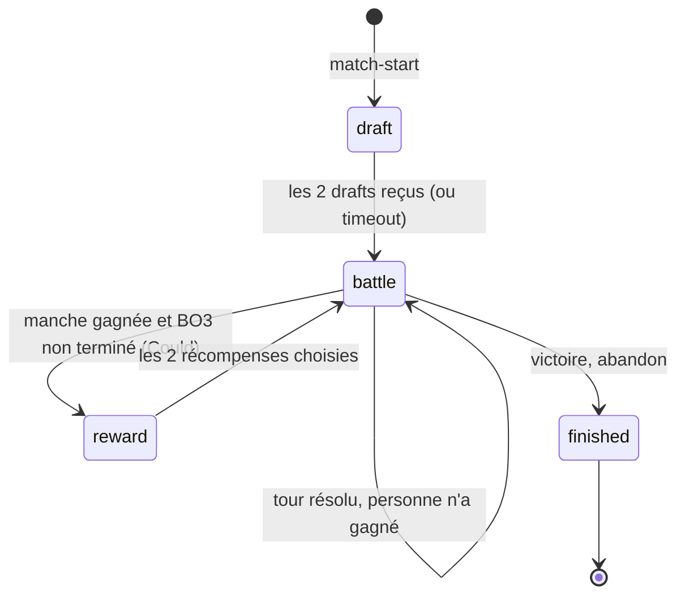
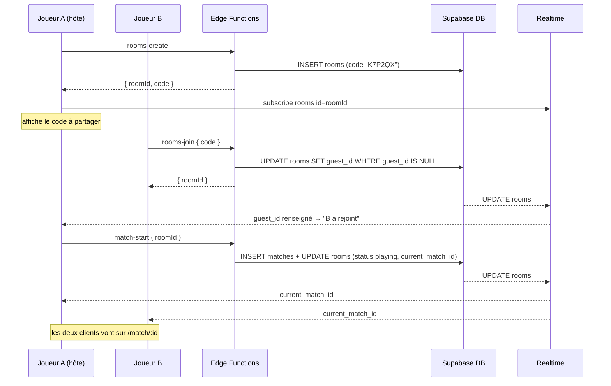
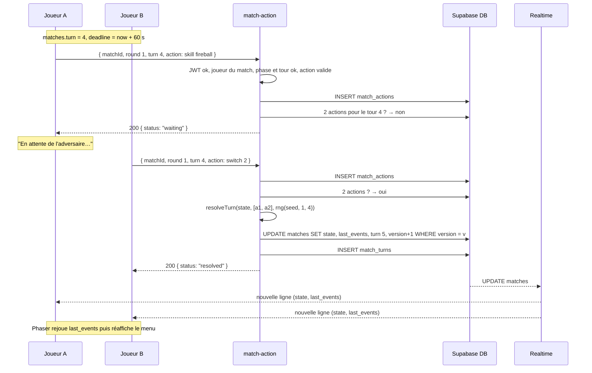

# 04 — Multijoueur tour par tour

## 1. Principes

| Principe | Mise en œuvre |
|---|---|
| **Serveur autoritaire** | Seule une Supabase Edge Function calcule le résultat d'un tour avec `shared/engine`. Le client ne fait qu'afficher |
| **Choix simultanés et secrets** | Chaque joueur envoie son action ; elle reste invisible pour l'adversaire tant que le tour n'est pas résolu |
| **Résolution quand les 2 actions sont reçues** | L'API qui reçoit la **deuxième** action résout le tour |
| **Diffusion par la BDD** | L'API met à jour `matches` ; Supabase Realtime pousse la mise à jour aux 2 clients |
| **Déterminisme** | `seed` du match + numéro de manche et de tour → même RNG partout |
| **Idempotence et concurrence** | Contrainte `unique` sur les actions + verrou optimiste `version` sur `matches` |

## 2. Machine à états d'un match



> **MVP** : `start` crée directement le match en phase `battle` avec des équipes tirées au hasard. `draft` et `reward` sont ajoutés si le temps le permet.

## 3. Cycle de vie d'un salon



> B doit s'abonner au salon **après** le `join`, car la RLS ne lui donne accès à la ligne qu'une fois `guest_id` renseigné.

## 4. Déroulé d'un tour



## 5. Résolution côté serveur

```ts
// supabase/functions/_shared/turns.ts
import { supabaseAdmin } from './supabaseAdmin.ts';
import { resolveTurn } from '../../../shared/engine/battle.ts';
import { createTurnRng } from '../../../shared/engine/rng.ts';
import type { Action, BattleState } from '../../../shared/types.ts';

export const TURN_DURATION_MS = 60_000;

/** Résout le tour courant si les 2 actions sont présentes. Sans danger si appelée plusieurs fois. */
export async function tryResolveBattleTurn(matchId: string): Promise<boolean> {
  const { data: match } = await supabaseAdmin
    .from('matches').select('*').eq('id', matchId).single();
  if (!match || match.phase !== 'battle') return false;

  const { data: actions } = await supabaseAdmin
    .from('match_actions')
    .select('player_id, payload')
    .eq('match_id', matchId)
    .eq('phase', 'battle')
    .eq('round', match.round)
    .eq('turn', match.turn);

  const a1 = actions?.find((a) => a.player_id === match.player1_id)?.payload as Action | undefined;
  const a2 = actions?.find((a) => a.player_id === match.player2_id)?.payload as Action | undefined;
  if (!a1 || !a2) return false; // on attend l'autre joueur

  const rng = createTurnRng(match.seed, match.round, match.turn);
  const { state, events, winnerSeat } = resolveTurn(match.state as BattleState, [a1, a2], rng);
  const finished = winnerSeat !== null;

  // Verrou optimiste : si un autre appel a déjà résolu ce tour, 0 ligne n'est modifiée
  const { data: updated } = await supabaseAdmin
    .from('matches')
    .update({
      state,
      last_events: events,
      turn: match.turn + 1,
      version: match.version + 1,
      phase: finished ? 'finished' : 'battle',
      winner_id: finished ? [match.player1_id, match.player2_id][winnerSeat] : null,
      turn_deadline: finished ? null : new Date(Date.now() + TURN_DURATION_MS).toISOString(),
      updated_at: new Date().toISOString(),
    })
    .eq('id', matchId)
    .eq('version', match.version)
    .select('id');

  if (!updated?.length) return false;

  await supabaseAdmin.from('match_turns').insert({
    match_id: matchId, round: match.round, turn: match.turn, events,
  });
  if (finished) {
    await supabaseAdmin.from('rooms').update({ status: 'finished' }).eq('id', match.room_id);
  }
  return true;
}
```

### Pourquoi c'est sûr en cas d'actions simultanées

| Situation | Protection |
|---|---|
| Un joueur clique deux fois | `unique (match_id, player_id, phase, round, turn)` : le 2ᵉ insert échoue (code `23505`) et l'API répond `409 ALREADY_PLAYED` |
| Les 2 actions arrivent en même temps et les 2 fonctions tentent de résoudre | `update … where version = v` : une seule réussit, l'autre renvoie 0 ligne et s'arrête |
| Action envoyée pour un tour déjà résolu | L'API compare `round`/`turn` et répond `409 STALE_TURN` |

## 6. Côté client : abonnement Realtime

```ts
// src/lib/realtime.ts
import { supabase } from './supabase';
import type { MatchRow } from '../../shared/types';

export function subscribeToMatch(matchId: string, onRow: (row: MatchRow) => void) {
  const channel = supabase
    .channel(`match:${matchId}`)
    .on(
      'postgres_changes',
      { event: 'UPDATE', schema: 'public', table: 'matches', filter: `id=eq.${matchId}` },
      (payload) => onRow(payload.new as MatchRow),
    )
    .subscribe(async (status) => {
      // Une fois abonné, on relit la ligne pour ne rater aucune mise à jour
      if (status === 'SUBSCRIBED') {
        const { data } = await supabase.from('matches').select('*').eq('id', matchId).single();
        if (data) onRow(data as MatchRow);
      }
    });

  return () => { supabase.removeChannel(channel); };
}
```

```ts
// src/pages/OnlineMatch.tsx (logique simplifiée)
const versionRef = useRef<number | null>(null);

useEffect(() => subscribeToMatch(matchId, (row) => {
  const isFirstLoad = versionRef.current === null;
  if (!isFirstLoad && row.version <= versionRef.current!) return; // déjà traitée
  versionRef.current = row.version;

  if (isFirstLoad) {
    EventBus.emit('battle-init', row.state, mySeat);  // reconnexion : on affiche l'état, sans rejouer
  } else {
    setUiLocked(true);
    EventBus.emit('play-events', row.last_events);    // animation, puis 'events-played'
    pendingStateRef.current = row.state;
  }
}), [matchId]);
```

### États de l'interface pendant un tour

| État | Affichage |
|---|---|
| `choosing` | Menu d'actions actif + compte à rebours |
| `waiting` | « En attente de l'adversaire… » (action envoyée) |
| `animating` | Menu masqué, Phaser rejoue `last_events` |
| `finished` | Écran Victoire / Défaite + retour au menu |

## 7. Timeout de tour (Should)

Aucun serveur ne tourne en continu : Render sert des fichiers statiques et les Edge Functions ne s'exécutent qu'à la réception d'une requête. Plutôt que d'ajouter une tâche planifiée côté Supabase, ce sont **les clients** qui réclament le timeout :

1. `matches.turn_deadline` est fixé à chaque nouveau tour (maintenant + 60 s).
2. Le client qui attend affiche le compte à rebours. Une fois la deadline dépassée, il appelle la fonction `match-timeout`.
3. L'API vérifie `now() > turn_deadline + 2 s de marge`, insère une **action par défaut** (`is_auto = true`) pour chaque joueur qui n'a pas joué, puis appelle `tryResolveBattleTurn`.
4. Action par défaut : première compétence qui a encore des PP (`strike` a des PP infinis, donc il y en a toujours une).
5. *(Could)* Après 3 timeouts consécutifs du même joueur → défaite par abandon.

## 8. Reconnexion (Should)

- La session Supabase est stockée dans le `localStorage` : un rafraîchissement garde le même utilisateur anonyme.
- Au lancement, le menu cherche un match `phase <> 'finished'` du joueur (requête dans [03](03-BASE-DE-DONNEES.md#5-requêtes-côté-client-exemples)) et propose « Reprendre la partie ».
- La page du match relit la ligne, affiche l'état **sans rejouer** d'animation, puis vérifie si le joueur a déjà joué ce tour :

```ts
const { data: mine } = await supabase.from('match_actions').select('id')
  .eq('match_id', matchId).eq('phase', 'battle').eq('round', row.round).eq('turn', row.turn)
  .maybeSingle();
setUiState(mine ? 'waiting' : 'choosing');
```

> ⚠️ Si le joueur vide son `localStorage` ou change de navigateur, il obtient un **nouvel** utilisateur anonyme et ne peut plus reprendre la partie. C'est acceptable pour ce projet.

## 9. Abandon

Fonction `match-forfeit` : passe le match en `finished`, fixe `winner_id` sur l'adversaire, ajoute un événement `forfeit` dans `last_events` et incrémente `version`. L'adversaire est notifié par Realtime.

## 10. Plan B : polling

Si Realtime pose problème (réseau d'école filtrant les WebSockets, quota atteint…) :

```ts
const id = setInterval(async () => {
  const { data } = await supabase.from('matches').select('*').eq('id', matchId).single();
  if (data) onRow(data);  // la vérification de version évite les doublons
}, 2000);
```

Le reste (API, BDD, moteur) ne change pas. **Tester le Realtime sur le réseau de l'école dès le sprint 3.**

## 11. Tester le multijoueur en local

1. Déployer les fonctions (`npx supabase functions deploy`) puis lancer `npm run dev` ; ou tester directement sur la preview Render de la PR.
2. Ouvrir **deux profils de navigateur différents** (ou une fenêtre normale + une fenêtre privée), pour avoir deux sessions anonymes distinctes.
3. Dans la fenêtre A, créer un salon ; dans la fenêtre B, le rejoindre avec le code.
4. Vérifier dans Supabase (Table Editor → `matches`) que `version` et `turn` augmentent à chaque tour.

### Scénarios de test manuels

| # | Scénario | Résultat attendu |
|---|---|---|
| M1 | A et B jouent un tour | Les 2 écrans animent le même tour, avec les mêmes dégâts |
| M2 | A clique deux fois sur une compétence | Une seule action est enregistrée, pas d'erreur visible |
| M3 | A joue, B attend 60 s | Le timeout joue automatiquement pour B |
| M4 | B rafraîchit la page en attente | B retrouve le match au bon tour |
| M5 | A met KO le dernier monstre de B | Victoire affichée chez A, défaite chez B, salon `finished` |
| M6 | C essaie d'envoyer une action sur le match de A et B | `403 NOT_A_PLAYER` |
| M7 | Envoi d'un `skillId` absent de la liste du monstre (via la console) | `400 INVALID_ACTION` |
