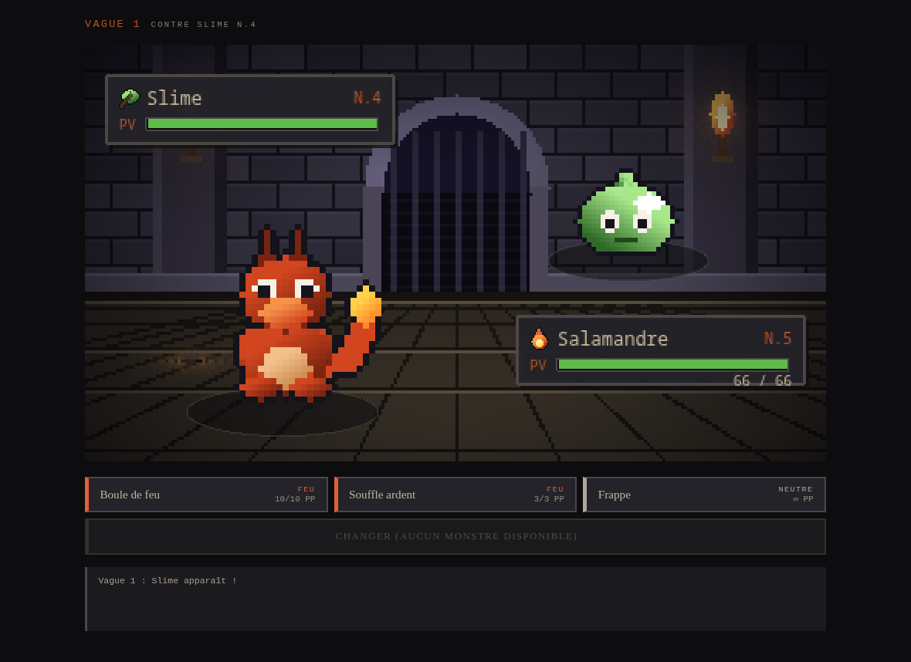
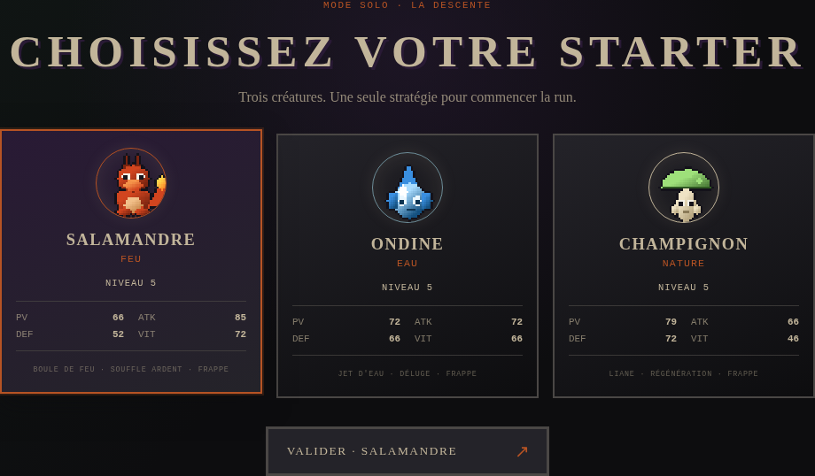
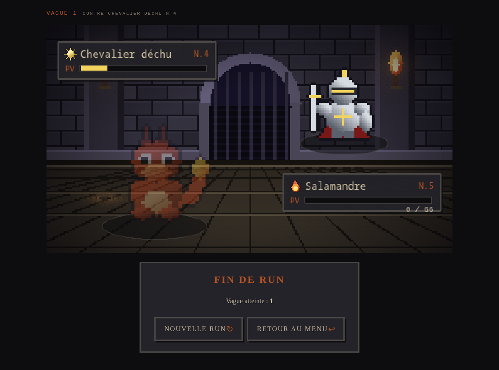

# Sprint 2 — Premier combat jouable

| | |
|---|---|
| **Créneau** | Mercredi 16/09, matin (08h45 → 10h30, 0,5 jour) |
| **Product Owner** | *à compléter* |
| **Scrum Master** | *à compléter* |
| **Développeurs** | Mattéo, Owen, Paul, Donovan |
| **Capacité** | 4 personnes × ~3 h |
| **Vélocité du sprint 1** | **12** points (18 engagés) |
| **Action de la rétro précédente** | Ne fermer une issue qu'une fois la DoD vérifiée sur la version en ligne |

## 📊 Bilan : ce qui a été fait

**Sprint Goal atteint.** Le mode solo est jouable de bout en bout sur la version en ligne : on choisit un starter, on enchaîne des vagues contre l'IA avec de vrais sprites, et la run se termine sur un écran de fin.

- **18 / 18 points terminés** : US-07 (5), US-08 (3), US-04 (3), US-10 (2), US-11 (5).
- 7 pull requests fusionnées dans `main` : [#34](https://github.com/kifuj/Dark-Dungeon-Fantasy-Boss-Battle/pull/34), [#35](https://github.com/kifuj/Dark-Dungeon-Fantasy-Boss-Battle/pull/35), [#36](https://github.com/kifuj/Dark-Dungeon-Fantasy-Boss-Battle/pull/36), [#37](https://github.com/kifuj/Dark-Dungeon-Fantasy-Boss-Battle/pull/37), [#38](https://github.com/kifuj/Dark-Dungeon-Fantasy-Boss-Battle/pull/38), [#39](https://github.com/kifuj/Dark-Dungeon-Fantasy-Boss-Battle/pull/39), [#40](https://github.com/kifuj/Dark-Dungeon-Fantasy-Boss-Battle/pull/40).
- Tests : **71 → 102** (31 nouveaux, dont 11 tests de composants React).
- Reste du sprint 1 : le 404 sur les URL directes **n'est toujours pas corrigé** (US-01 CA3) — voir [Problèmes rencontrés](#-problèmes-rencontrés). US-02 (Supabase) n'a pas avancé.
- Déploiement : <https://dark-dungeon-fantasy-boss-battle.onrender.com> (vérifié en jouant un tour sur la production).

## 🎯 Sprint Goal

> **Un joueur peut choisir un starter et enchaîner des combats contre l'IA dans le navigateur, avec de vrais sprites, sur la version en ligne.**

## 📋 Sprint Backlog

| US | Points | Tâche | Responsable | Statut |
|---|---|---|---|---|
| **US-07** Scène de combat | 5 | `PreloadScene` : chargement des spritesheets + animations d'attente | Mattéo | ✅ Fait ([#35](https://github.com/kifuj/Dark-Dungeon-Fantasy-Boss-Battle/pull/35)) |
| | | Assets : 10 monstres, 6 icônes d'élément, décor de donjon | Mattéo | ✅ Fait — générés par `tools/art/` (`npm run assets`) |
| | | `BattleScene` : placement face à face + fond | Mattéo | ✅ Fait |
| | | Encadrés nom / niveau / élément + barre de PV colorée | Mattéo | ✅ Fait (`shared/engine/hp.ts` + tests) |
| | | `EventBus` : `scene-ready`, `battle-init`, `battle-update`, `battle-banner` | Mattéo | ✅ Fait (doc 02 §5 mise à jour) |
| **US-08** Menu d'actions | 3 | Composant React `ActionMenu` (compétences, PP, couleurs) | Owen | ✅ Fait ([#37](https://github.com/kifuj/Dark-Dungeon-Fantasy-Boss-Battle/pull/37)) |
| | | Griser via `validateAction` + navigation clavier | Owen | ✅ Fait (4 tests de composants) |
| | | Masquer pendant la résolution (`play-events` / `events-played`) | Owen | ✅ Fait |
| **US-04** Changer | 3 | Sous-menu « Changer » + action `switch` envoyée au moteur | Donovan | ✅ Fait ([#38](https://github.com/kifuj/Dark-Dungeon-Fantasy-Boss-Battle/pull/38)) — non démontrable en solo (équipe d'un seul monstre) |
| **US-10** Starter | 2 | Page de choix du starter (3 cartes) + création de la run (seed) | Owen | ✅ Fait ([#39](https://github.com/kifuj/Dark-Dungeon-Fantasy-Boss-Battle/pull/39)) |
| **US-11** Vagues IA | 5 | `chooseAiAction` + tests | Paul | ✅ Fait ([#36](https://github.com/kifuj/Dark-Dungeon-Fantasy-Boss-Battle/pull/36)) |
| | | Génération d'ennemi par vague (`shared/engine/run.ts`) + tests | Paul | ✅ Fait |
| | | Page `SoloRun` : boucle tour → vague suivante → fin de run | Paul | ✅ Fait ([#40](https://github.com/kifuj/Dark-Dungeon-Fantasy-Boss-Battle/pull/40)) |
| | **18** | | | **18 points terminés** |

📸 **Capture du board GitHub Project en début de sprint** : `./captures/sprint-2-backlog.png` *(à ajouter depuis l'onglet Projects du dépôt)*

## 👥 Qui a fait quoi

### Planning Poker (rejoué en début de sprint)

Cartes : `1, 2, 3, 5, 8, 13, 21`. Référence : **US-05 = 2 points**.

| US | Tour 1 (Mattéo / Owen / Paul / Donovan) | Tour 2 | Retenu | Remarque |
|---|---|---|---|---|
| US-07 Scène de combat | 5 / 8 / 5 / 3 | 5 / 5 / 5 / 5 | **5** | Owen comptait les animations : elles sont dans l'US-09, pas ici. Donovan pensait réutiliser le cadre déjà posé au sprint 1. |
| US-08 Menu d'actions | 3 / 3 / 5 / 2 | — | **3** | Écart accepté : `validateAction` existe déjà, il ne reste que l'affichage. |
| US-04 Changer de monstre | 3 / 2 / 3 / 3 | — | **3** | Le moteur gère déjà le changement (sprint 1) ; le travail est dans l'interface. |
| US-10 Choisir un starter | 2 / 2 / 1 / 2 | — | **2** | Trois cartes et une création de run. |
| US-11 Vagues contre l'IA | 5 / 8 / 5 / 5 | 5 / 5 / 5 / 5 | **5** | Owen comptait les récompenses : elles sont dans l'US-12 (sprint 4). |

**Total engagé : 18 points**, comme les sprints 1 et 3 (la vélocité réelle du sprint 1 était de 12, mais 6 des 8 points manquants dépendaient de comptes externes — Render, Supabase — et non de la charge de développement).

### Affectation

| Membre | Compte GitHub | US / tâches | Points |
|---|---|---|---|
| Mattéo | `kifuj` | US-07 (scène, assets, barres de PV) | 5 |
| Owen | `Owen-Cazaux` | US-08 (menu d'actions), US-10 (starter) | 5 |
| Paul | `Paul-B-O` | US-11 (IA, vagues, boucle solo) | 5 |
| Donovan | `donovanmessager0-tech` | US-04 (changer de monstre) | 3 |

> **Traçabilité des commits** : le travail du matin a été poussé depuis deux comptes — `Owen-Cazaux` (première version de l'écran starter, commit `5ae08dc`, et du menu de combat dans Phaser, `87ef87d`) et `kifuj` (assets, scène de combat, moteur IA/vagues, menu React, boucle solo, documentation, PR #34 à #40). Le tableau ci-dessus reste la répartition décidée au Sprint Planning.

## ✅ Tâches terminées

| US | Critères d'acceptation | Preuve |
|---|---|---|
| **US-07** | CA1 ennemi en haut à droite / joueur en bas à gauche · CA2 encadré complet et barre verte/jaune/rouge · CA3 sprites nets · CA4 décor | Captures ci-dessus, `shared/tests/hp.test.ts` |
| **US-08** | CA1 compétences + élément + PP · CA2 action à 0 PP grisée · CA3 menu masqué pendant la résolution · CA4 souris **et** clavier | `src/tests/ActionMenu.test.tsx` (4 tests) |
| **US-04** | CA1 liste des coéquipiers sans le monstre actif · CA2 changement avant la compétence adverse · CA3 monstre KO refusé | `src/tests/ActionMenu.test.tsx` (4 tests) + `shared/tests/battle.test.ts` |
| **US-10** | CA1 les 3 starters avec sprite, élément et stats · CA2 la validation démarre la run au niveau 5 | `src/tests/StarterSelect.test.tsx`, capture « choix du starter » |
| **US-11** | CA1 ennemi de niveau 3+N tiré avec la seed · CA2 l'IA ne joue jamais une action invalide · CA3 vague suivante + 20 % de PV max · CA4 écran de fin avec la vague atteinte | `shared/tests/ai.test.ts`, `shared/tests/run.test.ts`, run complète jouée dans un navigateur automatisé |

Hors sprint backlog, terminé aussi : mise à jour des docs 02 (événements React ↔ Phaser), 07 (déploiement Render), 08 (assets générés, journal des décisions) et `CREDITS.md`, ajout de l'index de la documentation Scrum dans le `README`, et `render.yaml` pour la réécriture SPA.

## ⏳ Tâches non terminées

| Élément | État | Décision |
|---|---|---|
| **US-01 CA3** (404 sur les URL directes) | ❌ Non corrigé. La piste `public/_redirects` ne marche pas sur Render. `render.yaml` est en place mais ne s'applique qu'à un service relié à un Blueprint. | Reste ouverte : activer la règle **Redirects/Rewrites** dans le dashboard Render (2 min). Reportée au sprint 3. |
| **US-01** protection de `main` | ❌ Toujours désactivée | Reportée au sprint 3 |
| **US-02** Supabase (schéma, RLS, Realtime, variables) | ❌ Non entamée au sprint 2 | **Bloquante pour le sprint 3** (multijoueur) : à faire en tout début de sprint 3 |
| **US-09** animations et textes dans le canvas | Non engagée (objectif bonus du sprint 4) | `play-events` est déjà émis ; la scène applique l'état final et le journal texte est en HTML sous le canvas |
| Capture du board GitHub Project | Manquante | À prendre depuis l'onglet Projects et à déposer dans `captures/` |

## ⚠️ Problèmes rencontrés

1. **Deux implémentations en parallèle de l'US-08 et de l'US-10.** Une première version (menu d'action dans la scène Phaser avec une équipe codée en dur, écran starter avec des symboles à la place des sprites) a été poussée sur `main` à 09h22 et 09h34, pendant qu'une version branchée sur le moteur était développée en parallèle. Doublon détecté au daily n°2, arbitré tout de suite (voir Décisions).
2. **Render ne lit pas les fichiers `_redirects`.** Vérifié sur la production : `/_redirects` est servi comme un fichier ordinaire et `/menu` renvoie toujours 404. L'US-01 CA3 reste donc ouverte, alors qu'on la croyait réglée en début de sprint.
3. **Aucun pack de sprites utilisable dans un dépôt public.** Les packs repérés au sprint 1 sont soit sans licence claire, soit « redistribution interdite » (doc 08 §4).
4. **L'US-04 n'est pas démontrable en jeu.** En solo, l'équipe ne compte qu'un monstre tant que les récompenses (US-12) n'existent pas : le bouton « Changer » s'affiche donc désactivé. Les critères sont vérifiés par les tests, mais le PO ne peut pas le voir tourner — la DoR exigeait pourtant que le PO sache comment démontrer l'US.
5. **La run est très courte.** Sans récompense (US-12), une run s'arrête souvent à la vague 1 ou 2 : le starter niveau 5 affronte un ennemi niveau 4, et ne récupère que 20 % de ses PV entre deux vagues.

## 🧭 Décisions prises pendant le sprint

| Heure | Décision | Raison |
|---|---|---|
| 09h05 | **Les assets sont dessinés par notre propre code** (`tools/art/`, `npm run assets`) : 32 × 32 agrandi × 2, 2 images par monstre. | Aucun pack redistribuable ; le générateur donne exactement les 10 espèces du bestiaire, sous CC0, et se régénère en une commande. |
| 10h00 | **Le menu d'action reste en React**, au-dessus du canvas ; la `BattleScene` n'affiche que l'état que React lui envoie. La version du menu dans Phaser (`87ef87d`) est remplacée. | C'est la recommandation de la doc 02 §5 ; le menu React est testable (Testing Library) et branché sur `validateAction` et sur le vrai combat, la version Phaser travaillait sur une équipe codée en dur. |
| 10h00 | **L'écran starter garde la maquette d'Owen** (panneau, cartes, sélection puis « Valider · <monstre> ») et reçoit les vrais sprites et le moteur de run. | Le travail visuel déjà fait est conservé, seule la partie données est rebranchée. |
| 10h05 | **Tests de composants React** (Vitest + Testing Library, `src/tests/`). | Les critères d'acceptation d'interface (grisé, menu masqué, clavier) doivent être vérifiables autrement qu'à l'œil. |
| 10h05 | **2 ennemis à partir de la vague 6** (game design §6.1), au lieu d'un seul à toutes les vagues. | Coût nul (le moteur gère déjà les équipes) et cela rend visible le remplacement automatique d'un monstre KO. |
| 10h20 | **`_redirects` abandonné au profit de `render.yaml` + règle dashboard.** | Vérification sur la production : Render ignore le format `_redirects`. |

## 🗣️ Comptes rendus de Daily Scrum

### Daily n°1 — ⏰ 09h00

| Membre | Ce que j'ai fait depuis le dernier point | Ce que je fais maintenant | Blocages |
|---|---|---|---|
| Mattéo | Sprint Planning tenu (Sprint Goal, découpage en tâches, board à jour : les 5 US passées en `In progress`) | Assets du jeu : pas de pack redistribuable, on part sur un générateur maison, puis `PreloadScene` et `BattleScene` | Choix des assets, tranché ce matin |
| Owen | Écran de choix du starter (première version, commit `5ae08dc` à 09h22) | Menu de choix d'action | Aucun |
| Paul | Relecture de la doc 06 §8 et §9 (IA et boucle solo) | `chooseAiAction` et `shared/engine/run.ts` avec leurs tests | Aucun |
| Donovan | Vérification que `resolveTurn` gère déjà le changement de monstre (tests du sprint 1) | Sous-menu « Changer » dans l'interface | Dépend du menu d'actions d'Owen (US-08) |

**Décisions / actions :**
- Les assets seront **générés par notre code** (`tools/art/`) : licence propre, style homogène, régénérables (`npm run assets`).
- L'US-01 CA3 (404 sur les URL directes) est reprise en début de sprint : une piste `public/_redirects` est tentée ([PR #34](https://github.com/kifuj/Dark-Dungeon-Fantasy-Boss-Battle/pull/34)).
- Rappel de l'action de la rétro du sprint 1 : **on ne ferme une issue qu'après vérification sur la version en ligne**.

### Daily n°2 — ⏰ 10h00

| Membre | Ce que j'ai fait depuis le dernier point | Ce que je fais maintenant | Blocages |
|---|---|---|---|
| Mattéo | Générateur d'assets + 10 monstres + icônes + décor ; `PreloadScene`, `BattleScene`, encadrés et barres de PV ; `shared/engine/hp.ts` et ses tests ([PR #35](https://github.com/kifuj/Dark-Dungeon-Fantasy-Boss-Battle/pull/35)) | Fusion des PR du sprint et vérification sur la production | Doublon avec le menu Phaser d'Owen (voir décisions) |
| Owen | Menu de combat dans la scène Phaser (`87ef87d`) ; menu React `ActionMenu` + tests ([PR #37](https://github.com/kifuj/Dark-Dungeon-Fantasy-Boss-Battle/pull/37)) ; écran starter branché sur le moteur ([PR #39](https://github.com/kifuj/Dark-Dungeon-Fantasy-Boss-Battle/pull/39)) | Vérifier le choix du starter sur la production | Aucun |
| Paul | `chooseAiAction`, `run.ts`, `log.ts` et leurs tests ([PR #36](https://github.com/kifuj/Dark-Dungeon-Fantasy-Boss-Battle/pull/36)) ; page `SoloRun` ([PR #40](https://github.com/kifuj/Dark-Dungeon-Fantasy-Boss-Battle/pull/40)) | Enchaînement des vagues joué de bout en bout dans le navigateur | Aucun |
| Donovan | Sous-menu « Changer » + 4 tests ([PR #38](https://github.com/kifuj/Dark-Dungeon-Fantasy-Boss-Battle/pull/38)) | Constat : impossible à montrer en solo avec une équipe d'un seul monstre | Dépend de l'US-12 (récompenses, sprint 4) |

**Décisions / actions :**
- **Arbitrage du doublon** : le menu d'action reste **en React** (testable, branché sur le vrai combat) ; l'écran starter garde la **maquette d'Owen** et reçoit les sprites et le moteur. Les fichiers devenus doublons (`SoloStarter.tsx`, menu dans `BattleScene`) sont retirés — leur travail reste dans l'historique Git.
- **Règle d'équipe ajoutée** : une US = une branche `feat/US-XX-…` et une PR. On ne pousse plus directement sur `main` pendant un sprint (c'est la cause du doublon).
- Les 7 PR sont fusionnées dans `main` après `npm run build` + `npx vitest run` (102 tests verts) sur chaque branche.
- Vérification sur la production : le jeu est jouable, mais `/menu` en URL directe renvoie encore 404 → `_redirects` ne marche pas sur Render, on passe à `render.yaml` + la règle du dashboard, et l'US-01 repart au sprint 3.

## 🎬 Sprint Review

> Tenue à 10h15, avant la rétrospective.

**Présentée par (PO) :** *à compléter* — **URL démontrée :** <https://dark-dungeon-fantasy-boss-battle.onrender.com>

Déroulé : écran titre → menu → Solo → choix du starter (Salamandre) → vague 1 contre un Slime → un tour joué (Boule de feu, super efficace) → vague suivante → fin de run.

| US | Terminée (DoD) ? | Démontrée ? | Commentaire du PO |
|---|---|---|---|
| US-07 | ✅ | ✅ | Les sprites et le décor donnent enfin un vrai jeu ; les barres de PV changent bien de couleur |
| US-08 | ✅ | ✅ | Les PP et le grisé sont clairs ; la navigation clavier fonctionne |
| US-04 | ✅ | ⚠️ partiellement | Code et tests validés, mais le bouton reste désactivé en solo faute de 2ᵉ monstre |
| US-10 | ✅ | ✅ | La sélection puis la validation évitent les clics par erreur |
| US-11 | ✅ | ✅ | La boucle tourne ; la run est courte tant qu'il n'y a pas de récompenses |

- **Points engagés** : 18 — **Points terminés** : **18**
- **Sprint Goal atteint ?** ☑ Oui
- **US non terminées → retour au Product Backlog :** aucune du sprint 2 ; l'US-01 (CA3 + protection de `main`) et l'US-02 restent ouvertes et passent en tête du sprint 3.
- **Retours / nouvelles idées :**
  - Remonter **US-12 (récompenses)** avant le sprint 4 si le multijoueur avance vite : c'est ce qui rend la run intéressante et ce qui débloque la démonstration de l'US-04.
  - Vérifier la **courbe de difficulté** (niveau `3 + N` contre un starter niveau 5) au moment où les récompenses arrivent.
  - L'US-09 (animations) est très attendue pour la présentation de jeudi.

📸 

## 🔁 Rétrospective Keep, Drop, Try

> Tenue à 10h30, 15 minutes avant la fin du créneau.

| ✅ Keep | ❌ Drop | 🧪 Try |
|---|---|---|
| Une PR par US, avec `build` + tests verts avant la fusion | Pousser directement sur `main` pendant un sprint : c'est ce qui a créé deux fois le même écran | Annoncer au daily **le fichier** sur lequel on travaille, pas seulement l'US |
| Tester sur la production avant d'annoncer une US terminée (a permis de voir que `_redirects` ne marchait pas) | Croire une solution technique sur parole sans la vérifier en ligne | Vérifier en DoR que le PO peut **démontrer** l'US avec ce qu'on aura à la fin du sprint (cas de l'US-04) |
| Les tests de composants : les critères d'interface deviennent vérifiables | Reporter US-01 et US-02 de sprint en sprint | Commencer le sprint 3 par les 2 restes du sprint 1 (Supabase, réécriture Render) avant toute nouvelle US |

**Action d'amélioration retenue pour le sprint 3 :** *les 30 premières minutes du sprint 3 sont réservées à la fermeture d'US-01 et US-02 ; ensuite, toute US engagée passe par une branche et une PR, et la DoR est relue à voix haute avec la question « comment le PO le montrera-t-il ? ».*
