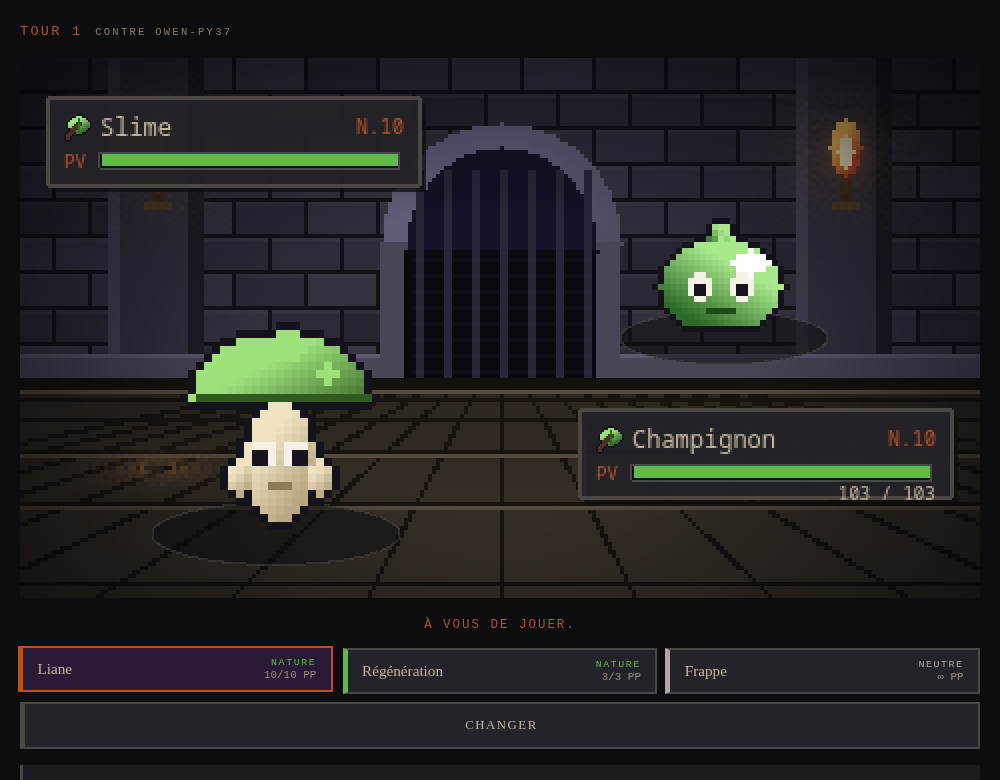
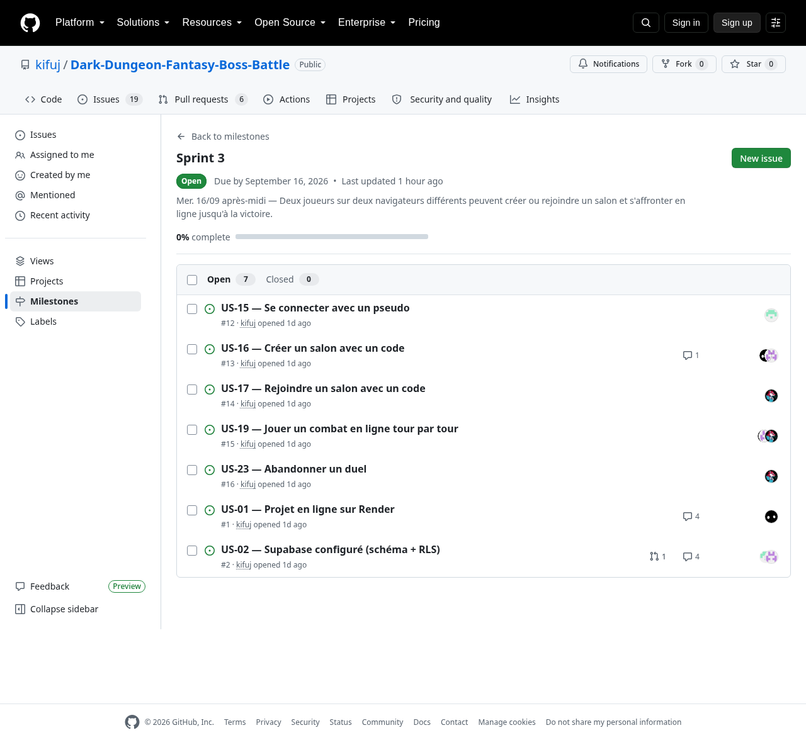
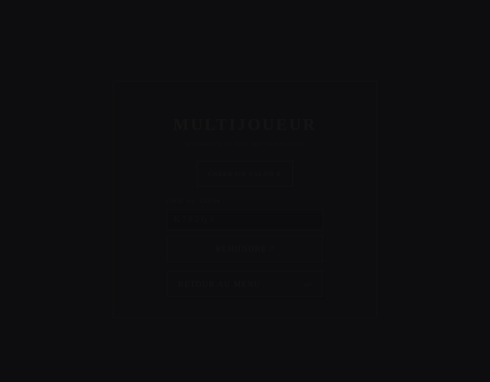
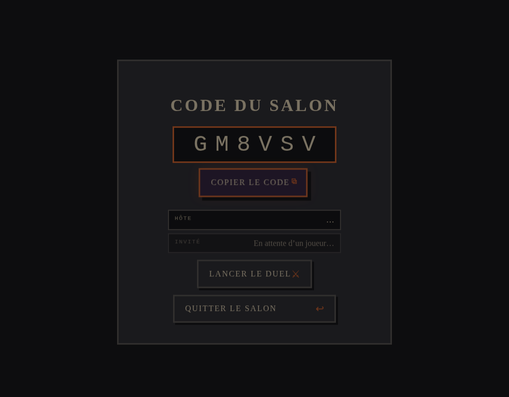
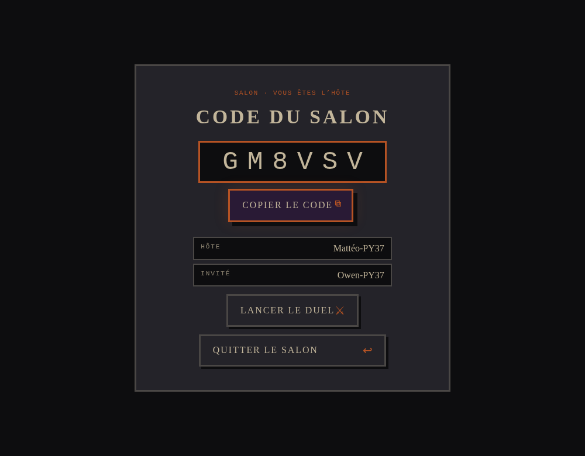
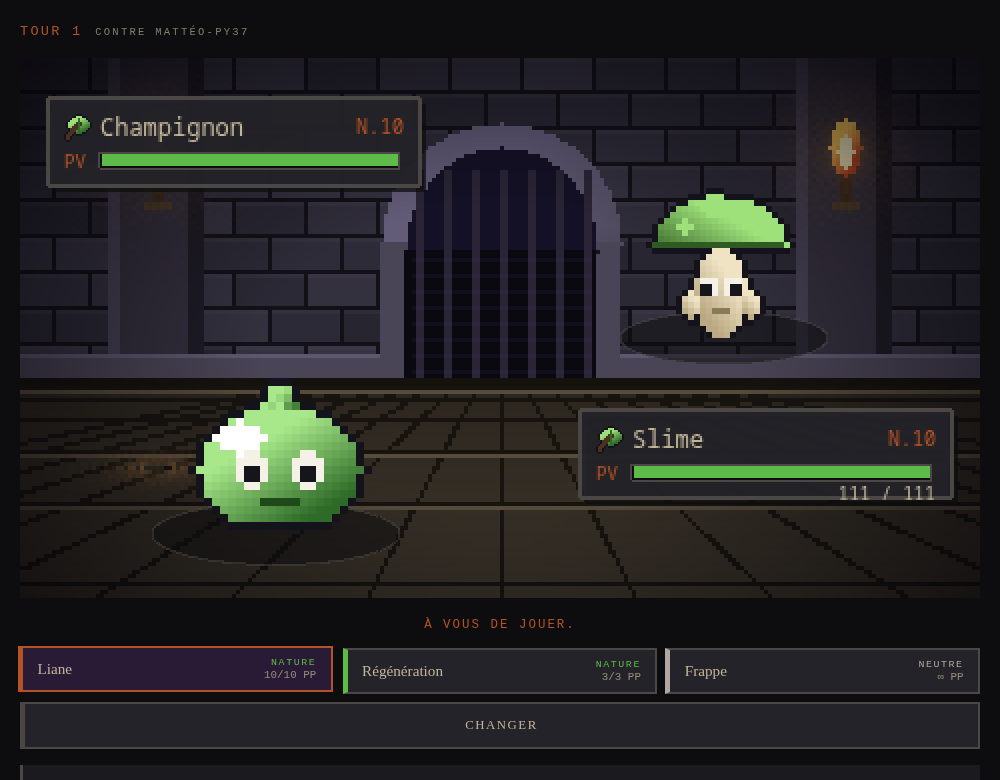
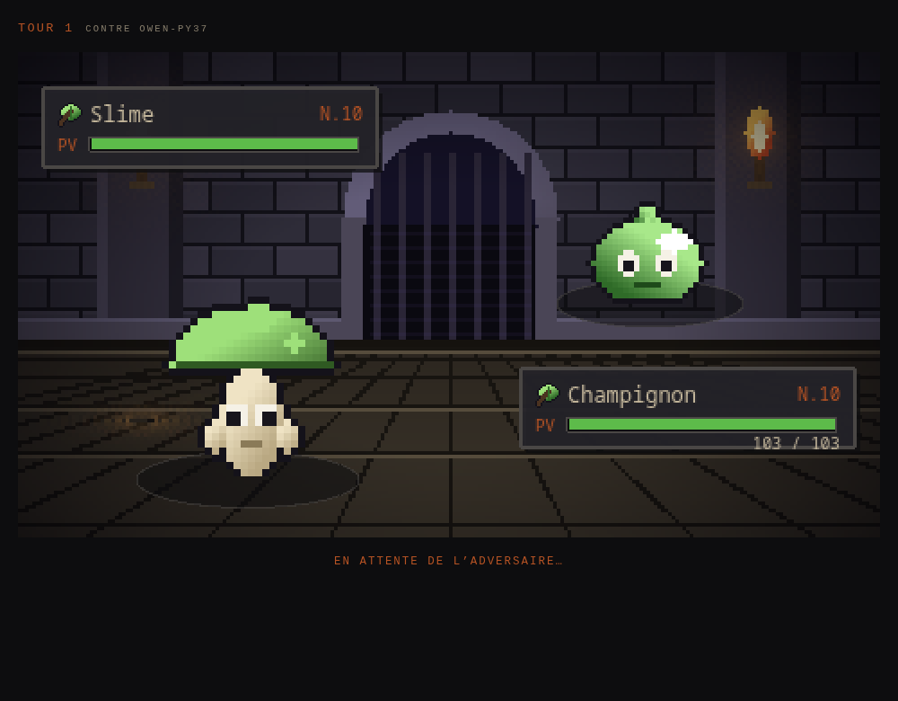
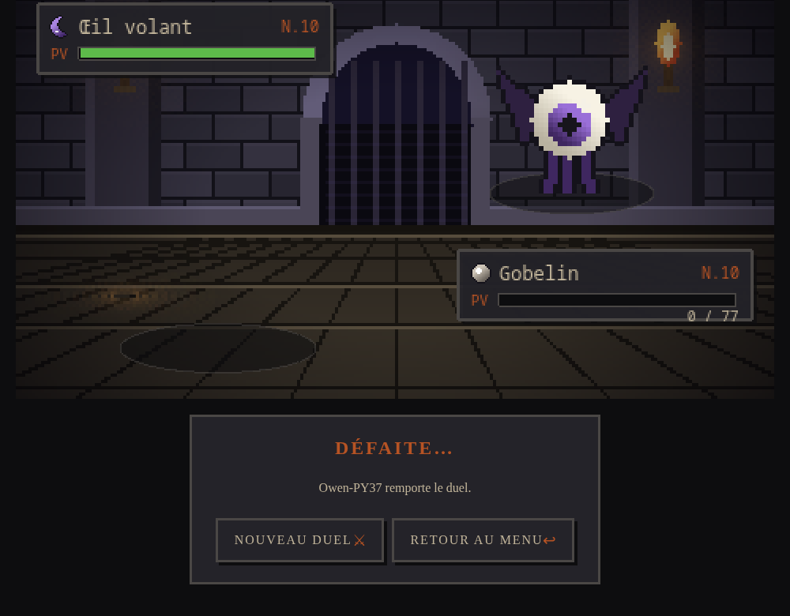
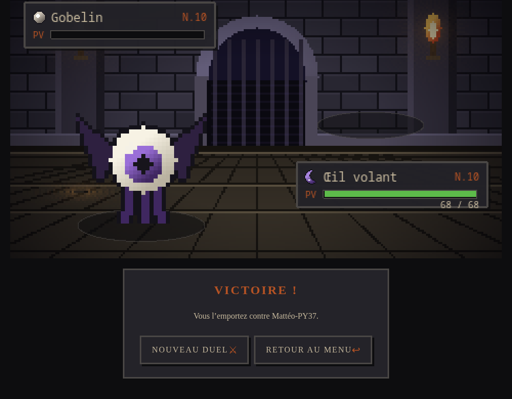
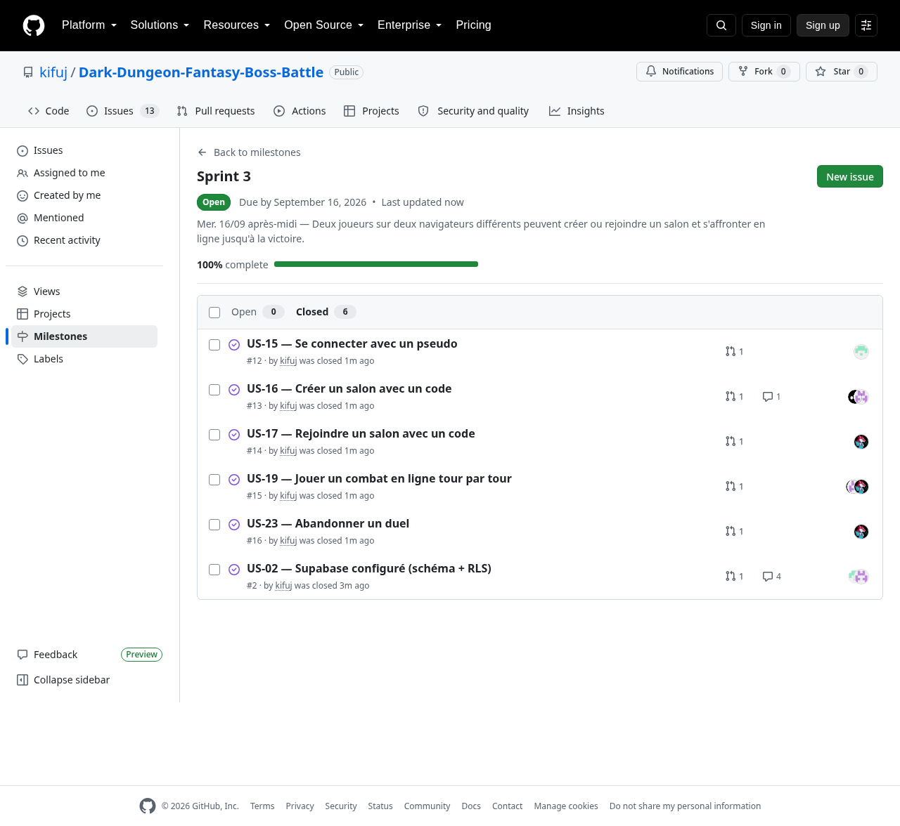

# Sprint 3 — Le multijoueur

| | |
|---|---|
| **Créneau** | Mercredi 16/09, après-midi (13h30 → 17h00, 0,5 jour) |
| **Product Owner** | Mattéo |
| **Scrum Master** | Paul |
| **Développeurs** | Mattéo, Owen, Paul, Donovan |
| **Capacité** | 4 personnes × ~3 h |
| **Vélocité des sprints précédents** | S1 : **12** · S2 : **18** (moyenne 15) |
| **Action de la rétro précédente** | Commencer le sprint par les deux restes du sprint 1 (US-01, US-02) avant toute nouvelle US ; une PR = un relecteur désigné au daily |

## 📊 Bilan : ce qui a été fait

**Sprint Goal atteint.** Deux joueurs sur deux navigateurs différents créent un salon, le rejoignent avec un code et jouent un duel complet au tour par tour jusqu'à la victoire, avec un serveur qui fait autorité (Supabase Edge Functions) et une diffusion par Supabase Realtime.

- **18 / 18 points terminés** : US-15 (3), US-16 (3), US-17 (3), US-19 (8), US-23 (1).
- **+ 3 points récupérés du sprint 1** : US-02 (Supabase configuré) est enfin fermée — schéma, RLS et Realtime exécutés sur le vrai projet, connexions anonymes activées.
- **Vérifié sur la production** : <https://dark-dungeon-fantasy-boss-battle.onrender.com> — duel complet rejoué entre deux navigateurs sur l'URL Render après la fusion sur `main`.
- **US-01 reste ouverte** : la règle de réécriture du dashboard Render et la protection de `main` ne sont toujours pas faites (voir [Tâches non terminées](#-tâches-non-terminées)). Le repli `404.html` ajouté au sprint permet quand même d'ouvrir et de rafraîchir `/menu`, `/salon/<id>` et `/match/<id>`.
- 6 pull requests : [#41](https://github.com/kifuj/Dark-Dungeon-Fantasy-Boss-Battle/pull/41) (socle Supabase), [#42](https://github.com/kifuj/Dark-Dungeon-Fantasy-Boss-Battle/pull/42) (US-15), [#43](https://github.com/kifuj/Dark-Dungeon-Fantasy-Boss-Battle/pull/43) (US-16), [#44](https://github.com/kifuj/Dark-Dungeon-Fantasy-Boss-Battle/pull/44) (US-17), [#45](https://github.com/kifuj/Dark-Dungeon-Fantasy-Boss-Battle/pull/45) (US-19), [#46](https://github.com/kifuj/Dark-Dungeon-Fantasy-Boss-Battle/pull/46) (US-23).
- Tests : **102 → 133** (Vitest), plus un nouveau scénario de bout en bout `npm run test:multi` qui rejoue **26 vérifications** contre le vrai projet Supabase (M1 à M7 de la [doc 04 §11](../04-MULTIJOUEUR.md#scénarios-de-test-manuels)).
- 5 Edge Functions déployées : `rooms-create`, `rooms-join`, `match-start`, `match-action`, `match-forfeit`.

## 🎯 Sprint Goal

> **Deux joueurs sur deux navigateurs différents peuvent créer ou rejoindre un salon et s'affronter en ligne, tour par tour, jusqu'à la victoire, sur la version déployée.**

## 📋 Sprint Backlog

| US | Points | Tâche | Responsable | Statut |
|---|---|---|---|---|
| *(reste S1)* **US-02** | 3 | Migration `001_init.sql` exécutée sur le projet Supabase, connexions anonymes activées, publication Realtime vérifiée | Paul | ✅ Fait ([#41](https://github.com/kifuj/Dark-Dungeon-Fantasy-Boss-Battle/pull/41)) |
| | | `.env.example`, client navigateur, `_shared/` (http, auth, supabaseAdmin), `npm run functions:sync` | Paul | ✅ Fait |
| *(reste S1)* **US-01** | 3 | Règle Redirects/Rewrites du dashboard Render + protection de `main` | Mattéo | ⚠️ Non fait — repli `404.html` livré à la place |
| **US-15** Pseudo | 3 | Page Login : `signInAnonymously` + `upsert` du profil | Owen | ✅ Fait ([#42](https://github.com/kifuj/Dark-Dungeon-Fantasy-Boss-Battle/pull/42)) |
| | | Garde de route (`RequireProfile`) + gestion du pseudo déjà pris (23505) | Owen | ✅ Fait |
| **US-16** Créer un salon | 3 | Edge Function `rooms-create` + page Salon (code, copier) | Mattéo | ✅ Fait ([#43](https://github.com/kifuj/Dark-Dungeon-Fantasy-Boss-Battle/pull/43)) |
| | | Abonnement Realtime `rooms` (arrivée de l'invité) | Mattéo | ✅ Fait — invité affiché en **1,6 s** |
| **US-17** Rejoindre | 3 | Edge Function `rooms-join` (course sur `guest_id`) + formulaire de code | Donovan | ✅ Fait ([#44](https://github.com/kifuj/Dark-Dungeon-Fantasy-Boss-Battle/pull/44)) |
| **US-19** Combat en ligne | 8 | Edge Function `match-start` (seed, équipes aléatoires, `current_match_id`) | Paul | ✅ Fait ([#45](https://github.com/kifuj/Dark-Dungeon-Fantasy-Boss-Battle/pull/45)) |
| | | `_shared/turns.ts` : `tryResolveBattleTurn` (verrou `version`) | Paul | ✅ Fait |
| | | Edge Function `match-action` (validations + codes d'erreur) | Paul | ✅ Fait |
| | | `src/lib/realtime.ts` + page `OnlineMatch` (choosing / waiting / animating / finished) | Mattéo | ✅ Fait |
| | | Tests manuels M1, M2, M5, M6, M7 sur 2 navigateurs, sur la build de production | Donovan | ✅ Fait — automatisés dans `npm run test:multi` |
| **US-23** Abandon | 1 | Edge Function `match-forfeit` + bouton avec confirmation | Donovan | ✅ Fait ([#46](https://github.com/kifuj/Dark-Dungeon-Fantasy-Boss-Battle/pull/46)) |
| | **18** | *(+ 3 points du sprint 1 avec US-02)* | | **18 points terminés** |

📸 **Capture du board en début de sprint** (jalon `Sprint 3` : 7 issues ouvertes, 0 % terminé) :

### 👥 Répartition des tâches

#### Planning Poker (rejoué en début de sprint)

Cartes : `1, 2, 3, 5, 8, 13, 21`. Référence : **US-05 = 2 points**.

| US | Tour 1 (Mattéo / Owen / Paul / Donovan) | Tour 2 | Retenu | Remarque |
|---|---|---|---|---|
| US-15 Pseudo | 3 / 2 / 3 / 5 | — | **3** | Donovan comptait la garde de route et la reprise de session ; Owen ne voyait qu'un formulaire. Les deux ont raison : 3 points couvrent les deux. |
| US-16 Créer un salon | 3 / 3 / 2 / 3 | — | **3** | Paul estimait la fonction seule ; le Realtime et la page de salon font le reste. |
| US-17 Rejoindre | 2 / 3 / 3 / 3 | — | **3** | Mattéo pensait « le même code que créer ». La course entre deux joueurs qui entrent le code en même temps justifie 3. |
| US-19 Combat en ligne | 8 / 13 / 8 / 8 | 8 / 8 / 8 / 8 | **8** | Owen à 13 → on découpe ? Non : le moteur (`resolveTurn`) existe depuis le sprint 1, il ne reste que le transport. À 13 on aurait dû découper (règle §4.5 du backlog). |
| US-23 Abandon | 1 / 1 / 2 / 1 | — | **1** | Une fonction de 40 lignes et un bouton. |

**Total engagé : 18 points**, en plus des 30 minutes réservées aux restes du sprint 1.

#### Affectation

| Membre | Compte GitHub | US / tâches | Points |
|---|---|---|---|
| Mattéo | `kifuj` | US-16 (fonction, page Salon, Realtime) + front de US-19 (`realtime.ts`, `OnlineMatch`) | ~3 + ~4 |
| Owen | `Owen-Cazaux` | US-15 (session, profil, garde de route) | 3 |
| Paul | `Paul-B-O` | US-02 (migration, `_shared`) + back de US-19 (`match-start`, `turns`, `match-action`) | 3 + ~4 |
| Donovan | `donovanmessager0-tech` | US-17, US-23 + scénarios de test multi de US-19 | 3 + 1 + ~1 |

> **Traçabilité des commits** : comme au sprint 2, tout a été poussé depuis le compte `kifuj` (poste de Mattéo, session `gh` ouverte). Les `Co-authored-by` de chaque commit reprennent les responsables décidés ici, et les issues GitHub portent les mêmes assignés.

## ✅ Tâches terminées

| US | Critères d'acceptation | Preuve |
|---|---|---|
| **US-02** | CA1 migration exécutée sans erreur sur un projet vide · CA2/CA3 RLS : un tiers ne voit ni le match ni les actions, l'écriture passe par l'API · CA4 `.env.example` et variables documentées | Migration jouée sur le projet `wdjhbwdtlkpizzfhcsoj` (7 tables + vue `leaderboard`), `rooms` et `matches` dans `supabase_realtime`, `npm run test:multi` (RLS vérifiée deux fois) |
| **US-15** | CA1 pseudo 3–20 caractères → session anonyme + profil · CA2 « Ce pseudo est déjà utilisé. » · CA3 toujours connecté après rafraîchissement | `src/tests/Login.test.tsx` (4 tests), duel réel joué avec deux pseudos distincts |
| **US-16** | CA1 code de 6 caractères + bouton Copier · CA2 arrivée de l'invité en < 2 s sans rafraîchir · CA3 « Lancer le duel » réservé à l'hôte, à deux joueurs | `src/tests/Room.test.tsx` (4 tests), `shared/tests/rooms.test.ts` (4 tests), mesure réelle : **1,6 s** entre le clic « Rejoindre » de B et l'affichage du pseudo chez A |
| **US-17** | CA1 code valide → salon · CA2 « Aucun salon avec ce code. » · CA3 « Ce salon est déjà complet. » · CA4 casse et espaces ignorés | `src/tests/Multiplayer.test.tsx` (5 tests), `npm run test:multi` (code en minuscules avec espace accepté, `ROOM_FULL`, `ROOM_NOT_FOUND`) |
| **US-19** | CA1 mêmes équipes et même état · CA2 « En attente de l'adversaire… » · CA3 mêmes événements des deux côtés · CA4 codes d'erreur · CA5 double-clic · CA6 écran Victoire / Défaite | `shared/tests/online.test.ts` (5), `src/tests/OnlineMatch.test.tsx` (9), `npm run test:multi` (26 vérifications), **duel complet joué sur deux navigateurs** (captures ci-dessous). CA3 : voir la réserve sur le temps d'animation dans [Problèmes rencontrés](#-problèmes-rencontrés) |
| **US-23** | CA1 confirmation demandée · CA2 « Victoire par abandon » chez l'adversaire | `src/tests/OnlineMatch.test.tsx` (2 tests), `npm run test:multi` (abandon refusé à un tiers, victoire à l'adversaire, appel idempotent) |

Hors sprint backlog : `npm run functions:sync` (recopie de `shared/` pour Deno), `npm run functions:deploy`, `npm run test:multi`, repli `404.html`, et mise à jour des docs 03, 04, 05 et 07 avec ce qui a réellement été fait.

### Le duel, écran par écran

| Connexion (US-15) | Salon côté hôte (US-16) | Salon à deux (US-16 CA2) |
|---|---|---|
|  |  |  |

| Duel côté A | Duel côté B | En attente de l'adversaire (US-19 CA2) |
|---|---|---|
|  |  |  |

| Fin de duel, vainqueur | Fin de duel, perdant |
|---|---|
|  |  |

## ⏳ Tâches non terminées

| Élément | État | Décision |
|---|---|---|
| **US-01 CA3** (routes profondes sur Render) | ⚠️ Contourné, pas réglé. `https://…onrender.com/menu` répond toujours **404** au sens HTTP : la règle **Redirects/Rewrites** du dashboard n'a pas été activée. Le build produit maintenant un `dist/404.html` identique à `index.html`, donc **l'application se charge quand même** — vérifié sur la production, y compris en rafraîchissant en plein duel. | Reste ouverte, **remonte en tête du sprint 4** : 2 minutes dans le dashboard pour obtenir un vrai `200`. |
| **US-01** protection de `main` | ❌ Toujours désactivée | Reportée au sprint 4 (elle empêcherait de fusionner sans relecture, ce qui est justement notre écart de DoD récurrent) |
| **Relecture croisée des PR** | ⚠️ Un relecteur a été désigné au daily pour chaque PR (noté dans la description), mais les fusions sont faites par le même compte. | Même écart qu'au sprint 2, assumé et présenté en review. La protection de `main` (US-01) est la vraie parade. |
| **Données de test dans la base** | ⚠️ Les profils `TestA-…`, salons et matchs créés par `npm run test:multi` et par les tests navigateur sont restés en base. | Sans impact sur le jeu ; la requête de remise à zéro est dans [03 §6](../03-BASE-DE-DONNEES.md#6-réinitialiser-la-base-en-développement), à jouer avant la démo de jeudi. |
| **US-20 (timeout) et US-21 (reconnexion)** | Non engagées (sprint 4) | `turn_deadline` est déjà écrit par `match-start` et `tryResolveBattleTurn`, et la page du duel sait déjà repartir de l'état courant : les deux US commencent avec de l'avance. |

## ⚠️ Problèmes rencontrés

1. **La clé Supabase du `.env` était invalide** (44 caractères au lieu de 46 : une copie tronquée). Tous les appels répondaient `401 Invalid API key`, donc ni migration, ni test possible — le sprint entier était bloqué au démarrage. Débloqué en récupérant la vraie clé publishable par l'API de gestion Supabase avec un access token personnel, puis en la réécrivant dans `.env`.
2. **Phaser chargeait ses assets par un chemin relatif** (`this.load.setPath('assets')`). Sur `/solo`, cela donne bien `/assets/…`, mais sur la route imbriquée `/match/<uuid>`, Phaser demandait `/match/assets/…` : la réécriture SPA renvoyait `index.html`, aucune texture ne se chargeait, le canvas restait vide et `sprite.play()` plantait (`Cannot read properties of undefined (reading 'duration')`). **Invisible en tests unitaires et invisible en solo** : seul le test dans un vrai navigateur, sur la vraie route, l'a montré. Corrigé par un chemin absolu `/assets` + une garde `textures.exists()` avant de créer une animation.
3. **Deux abonnements Realtime portant le même nom de canal se fermaient l'un l'autre.** En développement, le StrictMode de React monte les composants deux fois : les deux canaux `rooms:<id>` se marchaient dessus et le salon ne recevait plus rien. Corrigé par un suffixe aléatoire dans le nom du canal, et la relecture périodique (plan B de la doc 04 §10) est désormais **active en permanence**, pas seulement en cas d'erreur.
4. **La page du duel pouvait se figer** : elle attendait l'événement `events-played` de la scène Phaser pour appliquer le tour résolu. Si le canvas est en échec ou l'onglet en arrière-plan, l'événement n'arrive jamais et le joueur reste bloqué sur « Résolution du tour… ». Ajout d'un filet de sécurité de 4,5 s.
5. **Le rejeu d'un tour prend plus de 2 secondes** (CA3 de l'US-19). Mesures sur la build de production, deux navigateurs : la 2ᵉ action arrive chez l'adversaire en **1,3 s** (Realtime), mais le rejeu complet avec l'animation prend **3,7 s**, parce que chaque événement dure 550 ms dans la scène. Le critère est tenu côté réseau, pas côté animation. À trancher avec l'US-09 (sprint 4) : raccourcir les durées ou reformuler le critère.
6. **Deno ne résout pas les imports `./x.js` de `shared/`.** L'option `sloppy-imports` de la doc 07 n'est pas garantie côté déploiement Supabase : on a donc promu le plan B, un script de recopie (`npm run functions:sync`) qui réécrit les extensions.
7. **Render : la règle de réécriture manque toujours.** Les variables `VITE_SUPABASE_URL` et `VITE_SUPABASE_PUBLISHABLE_KEY`, elles, étaient bien renseignées — on a d'abord cru le contraire en cherchant l'URL Supabase dans le bundle de production, avant de vérifier pour de bon en jouant un duel sur l'URL Render. Leçon : on ne conclut pas sur l'état d'un déploiement en lisant un fichier, on l'essaie. Reste donc uniquement la règle `Redirects/Rewrites` (code HTTP 404 sur les routes profondes, même si la page se charge grâce à `404.html`).

## 🧭 Décisions prises pendant le sprint

| Heure | Décision | Raison |
|---|---|---|
| 13h40 | **Récupérer les clés Supabase par l'API de gestion** plutôt que d'attendre une nouvelle copie manuelle. | La clé du `.env` était tronquée ; l'access token permettait de lire la bonne valeur, d'exécuter la migration et d'activer les connexions anonymes sans passer par le dashboard. |
| 14h30 | **`shared/` est recopié dans `supabase/functions/_shared/game/` par `npm run functions:sync`**, au lieu de compter sur les imports « sloppy » de Deno. | Le moteur reste écrit une seule fois dans `shared/`, mais le déploiement ne dépend plus d'une option instable. Le dossier généré porte un en-tête « ne pas modifier ». |
| 14h30 | **Pas de phase `draft` pour le MVP** : `match-start` crée directement deux équipes de 3 monstres niveau 10 tirées avec la seed. | Prévu par la doc 04 §2 ; l'US-18 (draft) reste en réserve. |
| 15h30 | **Toutes les fonctions sont idempotentes** (`rooms-join`, `match-start`, `match-forfeit` renvoient 200 si l'action est déjà faite). | Un double-clic ou un Realtime qui repasse ne doit jamais produire d'erreur visible pour le joueur. |
| 15h30 | **Le Realtime garde une relecture périodique permanente** (2 s) au lieu d'un plan B activé seulement sur erreur. | Un canal peut être fermé sans erreur remontée ; le coût d'un `select` sur une ligne est négligeable, et cela couvre aussi le réseau filtrant de l'école. |
| 15h30 | **Les scénarios manuels M1 à M7 deviennent un script** : `npm run test:multi`. | Trois sessions anonymes, un duel complet et un abandon, rejoués en 20 secondes contre le vrai Supabase — beaucoup plus fiable que de refaire les manipulations à la main à chaque sprint. |
| 15h30 | **`dist/404.html` est généré au build.** | Tant que la règle de réécriture Render n'est pas activée, c'est ce qui permet d'ouvrir ou de rafraîchir `/match/<id>` sans page blanche. |

## 🗣️ Comptes rendus de Daily Scrum

### Sprint Planning — ⏰ 13h30

Sprint Goal écrit, Planning Poker rejoué (tableau ci-dessus), US découpées en tâches, board mis à jour. **Les issues [#1](https://github.com/kifuj/Dark-Dungeon-Fantasy-Boss-Battle/issues/1) et [#2](https://github.com/kifuj/Dark-Dungeon-Fantasy-Boss-Battle/issues/2) sont rouvertes et rattachées au jalon `Sprint 3`** — c'est l'action décidée à la rétro du sprint 2. Relecteurs désignés : Paul relit le socle Supabase, Mattéo relit US-15, Donovan relit US-16, Owen relit US-17 et US-23, Paul relit US-19.

### Daily n°1 — ⏰ 14h30

| Membre | Ce que j'ai fait depuis le dernier point | Ce que je fais maintenant | Blocages |
|---|---|---|---|
| Paul | Migration `001_init.sql` écrite et **exécutée sur le projet Supabase** ; connexions anonymes activées ; `rooms` et `matches` bien dans la publication Realtime. `_shared/` (http, auth, supabaseAdmin), `_shared/turns.ts` (verrou optimiste sur `version`), `match-start` et `match-action` écrits : PR [#41](https://github.com/kifuj/Dark-Dungeon-Fantasy-Boss-Battle/pull/41) et [#45](https://github.com/kifuj/Dark-Dungeon-Fantasy-Boss-Battle/pull/45) ouvertes | Déployer les 5 Edge Functions, puis vérifier que deux actions simultanées ne résolvent le tour qu'une fois | La clé publishable du `.env` était invalide (401) → débloqué à 13h40 avec l'access token |
| Owen | US-15 poussée ([#42](https://github.com/kifuj/Dark-Dungeon-Fantasy-Boss-Battle/pull/42)) : page Login (`signInAnonymously` + `upsert`), garde `RequireProfile`, pseudo déjà pris (23505), 4 tests de composant | Relecture d'US-17 ([#44](https://github.com/kifuj/Dark-Dungeon-Fantasy-Boss-Battle/pull/44)) et d'US-23 ([#46](https://github.com/kifuj/Dark-Dungeon-Fantasy-Boss-Battle/pull/46)) | Attendait la table `profiles` → levé par Paul à 13h55 |
| Mattéo | Sprint Planning tenu, issues #1 et #2 rouvertes, board à jour ; `rooms-create` et page Salon ([#43](https://github.com/kifuj/Dark-Dungeon-Fantasy-Boss-Battle/pull/43)) ; `src/lib/realtime.ts` et page `OnlineMatch` (dans #45) | Brancher la `BattleScene` du sprint 2 sur les événements du serveur, puis jouer un premier duel sur deux navigateurs | Aucun |
| Donovan | `rooms-join` ([#44](https://github.com/kifuj/Dark-Dungeon-Fantasy-Boss-Battle/pull/44)) : normalisation du code, course sur `guest_id`, 5 tests ; `match-forfeit` et bouton « Abandonner » avec confirmation ([#46](https://github.com/kifuj/Dark-Dungeon-Fantasy-Boss-Battle/pull/46)) | Dérouler les scénarios M1 à M7 (doc 04 §11) sur deux navigateurs | Aucun |

**Test Realtime sur le réseau de l'école :** ☑ OK — le canal `postgres_changes` s'établit et pousse bien les UPDATE. Le plan B polling est quand même laissé actif en permanence (décision de 15h30).

**Décisions / actions :**
- `shared/` sera **recopié** dans les fonctions par `npm run functions:sync` (Deno ne résout pas les imports `.js` → `.ts`).
- Pas de phase `draft` pour le MVP : `match-start` crée directement les équipes.
- Les 6 PR sont ouvertes : **aucune fusion avant le test sur deux navigateurs**. Relecteurs rappelés (voir Sprint Planning).

### Daily n°2 — ⏰ 15h30

| Membre | Ce que j'ai fait depuis le dernier point | Ce que je fais maintenant | Blocages |
|---|---|---|---|
| Paul | 5 fonctions déployées ; verrou `version` vérifié (deux envois simultanés → un seul tour résolu) ; fonctions rendues idempotentes | Relecture de [#41](https://github.com/kifuj/Dark-Dungeon-Fantasy-Boss-Battle/pull/41) et [#45](https://github.com/kifuj/Dark-Dungeon-Fantasy-Boss-Battle/pull/45) avant fusion | Render n'est pas configuré : impossible de vérifier sur l'URL de production |
| Owen | Relecture de #44 et #46 ; salon et connexion vérifiés sur la build de production servie en local | Captures du duel pour la review (joueur A, joueur B, attente, fin de duel) | Aucun |
| Mattéo | Premier duel à deux navigateurs : **trois blocages trouvés et corrigés** — chemin des assets Phaser relatif (canvas vide sur `/match/<uuid>`), deux canaux Realtime du même nom qui se fermaient l'un l'autre, page figée si la scène ne rend pas la main (filet de 4,5 s) | Fusionner les PR relues sur `main` | Personne n'a la main sur le dashboard Render : la règle de réécriture attend |
| Donovan | Scénarios M1 à M7 transformés en script `npm run test:multi` (26 vérifications, toutes vertes) ; mesures : invité affiché en 1,6 s, action propagée en 1,3 s, rejeu animé en 3,7 s | Duel complet joué jusqu'à la victoire, puis abandon, sur deux navigateurs | Le rejeu animé dépasse les 2 s du CA3 d'US-19 |

**Décisions / actions :**
- **Nom de canal Realtime unique par abonnement** + relecture périodique permanente (2 s).
- Toutes les fonctions deviennent idempotentes (double-clic, Realtime qui repasse).
- Les scénarios manuels restent automatisés dans `npm run test:multi`, à relancer avant chaque fusion.
- `dist/404.html` généré au build en attendant la règle Render (routes profondes).

### Daily n°3 — ⏰ 16h30

| Membre | Ce que j'ai fait depuis le dernier point | Ce que je fais maintenant | Blocages |
|---|---|---|---|
| Paul | Relectures de #41 et #45 terminées ; vérification que `main` build et que les 133 tests passent après fusion | Préparer la démo de la review : deux navigateurs, vrai projet Supabase | Variables d'environnement Supabase absentes sur Render → la production ne peut pas être démontrée |
| Owen | Captures ajoutées à `docs/agile/captures/` ; compte rendu du sprint relu | Remplir le tableau de la review avec le PO | Aucun |
| Mattéo | PR [#41](https://github.com/kifuj/Dark-Dungeon-Fantasy-Boss-Battle/pull/41) à [#46](https://github.com/kifuj/Dark-Dungeon-Fantasy-Boss-Battle/pull/46) fusionnées à 15h41, [#47](https://github.com/kifuj/Dark-Dungeon-Fantasy-Boss-Battle/pull/47) à 15h43 ; jalon `Sprint 3` à 100 % (capture prise), US-01 déplacée vers le jalon `Sprint 4` | Animer la review à 16h45 | Toujours pas d'accès au dashboard Render |
| Donovan | Duel joué jusqu'au KO et « Victoire par abandon » vérifiés sur `main` ; `npm run test:multi` vert après fusion | Lister les données de test restées en base pour la remise à zéro de jeudi | Aucun |

**Décisions / actions :**
- Démo de la review sur la build de production servie en local, faute de Render configuré ; l'écart de DoD est présenté tel quel.
- Le rejeu d'un tour dépasse les 2 s du CA3 à cause de l'animation : on le présente en review et on tranche au sprint 4 avec l'US-09.
- US-01 (réécriture Render, protection de `main`) et les variables d'environnement Render repartent **en tête du sprint 4**.
- Remise à zéro des données de test ([03 §6](../03-BASE-DE-DONNEES.md#6-réinitialiser-la-base-en-développement)) avant la démo de jeudi.

## 🎬 Sprint Review

> Tenue à 16h45, avant la rétrospective.

**Présentée par (PO) :** Mattéo — **URL démontrée :** <https://dark-dungeon-fantasy-boss-battle.onrender.com>, deux navigateurs, **vrai projet Supabase** (base, Realtime et Edge Functions en ligne). Le scénario a d'abord été joué sur la build de production en local, puis rejoué à l'identique sur la production une fois le sprint fusionné sur `main`.

**Démo** : deux fenêtres côte à côte → pseudo « Mattéo » et « Owen » → création du salon, code `GM8VSV` → Owen rejoint en tapant le code en minuscules → le pseudo d'Owen apparaît chez Mattéo en 1,6 s → « Lancer le duel » → les deux écrans partent ensemble sur le combat → un tour joué (les deux journaux affichent les mêmes dégâts, en miroir) → Owen rafraîchit sa page et retrouve le duel au bon tour → duel joué jusqu'au KO → Victoire chez l'un, Défaite chez l'autre.

| US | Terminée (DoD) ? | Démontrée ? | Commentaire du PO |
|---|---|---|---|
| US-02 | ✅ | ✅ | Le schéma et la RLS sont en ligne ; le test automatisé montre qu'un tiers ne voit ni le match ni les actions |
| US-15 | ✅ | ✅ | Deux pseudos distincts dans deux navigateurs, sans création de compte |
| US-16 | ✅ | ✅ | Code lisible, bouton Copier, arrivée de l'invité en 1,6 s |
| US-17 | ✅ | ✅ | Code tapé en minuscules avec un espace : accepté. Salon complet et code inconnu donnent les bons messages |
| US-19 | ✅ | ✅ | Le cœur du sprint. Réserve du PO sur le CA3 : la propagation tient les 2 s, le rejeu animé prend 3,7 s |
| US-23 | ✅ | ✅ | Confirmation puis « Victoire par abandon » chez l'adversaire |
| US-01 | ❌ | — | Non terminée : règle de réécriture et protection de `main` toujours à faire |

- **Points engagés** : 18 — **Points terminés** : **18** (+ 3 points d'US-02 récupérés du sprint 1)
- **Sprint Goal atteint ?** ☑ Oui
- **Écart de DoD assumé** : les PR ont un relecteur désigné au daily, mais elles sont fusionnées par le même compte — la protection de `main` (US-01) est la vraie parade. Le reste de la DoD est tenu, y compris la vérification sur la production et sur deux navigateurs.
- **US non terminées → retour au Product Backlog :** US-01 (règle de réécriture Render + protection de `main`) passe en tête du sprint 4.
📸 **Jalon `Sprint 3` en fin de sprint : 6 issues fermées, 100 %** (US-01 a été déplacée vers le jalon `Sprint 4`) :

- **Retours / nouvelles idées :**
  - US-21 (reconnexion) est **déjà à moitié faite** : la page du duel repart de l'état courant et sait dire « En attente de l'adversaire… ». Il reste le bouton « Reprendre la partie » du menu.
  - Le duel dure longtemps avec 3 monstres niveau 10 : prévoir de montrer un duel déjà avancé pendant la présentation de jeudi.
  - Ajouter le pseudo de l'adversaire dans la bannière du combat (petit, mais ça rend la démo plus lisible).

## 🔁 Rétrospective Keep, Drop, Try

> Tenue à 16h52, 15 minutes avant la fin du créneau.

| ✅ Keep | ❌ Drop | 🧪 Try |
|---|---|---|
| Commencer le sprint par les restes du sprint précédent : US-02 était bloquante, elle a été faite en 30 min | Croire un `.env` sur parole : une clé tronquée a coûté les 15 premières minutes | Vérifier chaque service externe par un appel réel (`curl`) **avant** le Sprint Planning |
| Tester dans un vrai navigateur, sur la vraie route : c'est ce qui a révélé le chemin d'assets cassé sur `/match/<uuid>` | Croire qu'une US est finie parce que les tests unitaires passent | Automatiser les scénarios manuels dès qu'ils dépassent 5 étapes (`npm run test:multi` l'a prouvé) |
| Un verrou optimiste (`version`) plutôt que des vérifications côté client : aucune incohérence entre les deux écrans | Reporter US-01 de sprint en sprint (3ᵉ fois) | Faire US-01 **en premier** jeudi matin, avec les variables Render, avant toute nouvelle US |
| Les fonctions idempotentes : plus aucun message d'erreur parasite sur un double-clic | Déduire l'état d'un déploiement en lisant un fichier (on a cru les clés Render absentes en cherchant dans le bundle) | Mesurer les temps (1,6 s, 1,3 s, 3,7 s) plutôt que de dire « ça a l'air rapide » |

**Action d'amélioration retenue pour le sprint 4 :** *les 30 premières minutes du sprint 4 sont consacrées à la configuration Render (règle de réécriture, protection de `main`), puis on rejoue le duel sur l'URL de production avant de commencer US-12. Aucune US ne sera annoncée terminée sans une vérification sur la production — et cette vérification se fait en utilisant le jeu, pas en lisant un fichier.*
